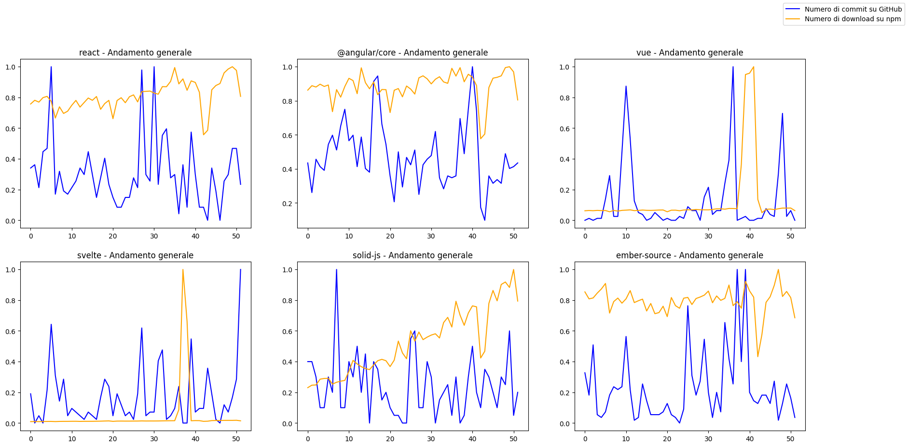

# Correlation between GitHub Commits and npm Downloads: An Analysis

## Introduction

In this project, we analyzed whether there is a correlation between the number of commits in a GitHub repository
and the number of downloads executed on npm.
In particular, we want to verify if, as the number of commits increases, the number of downloads also increases.

We used the following libraries:

- React: [GitHub](https://github.com/facebook/react) - [npm](https://www.npmjs.com/package/react)
- Angular: [GitHub](https://github.com/angular/angular) - [npm](https://www.npmjs.com/package/@angular/core)
- Vue: [GitHub](https://github.com/vuejs/core) - [npm](https://www.npmjs.com/package/vue)
- Svelte: [GitHub](https://github.com/sveltejs/svelte) - [npm](https://www.npmjs.com/package/svelte)
- Solid: [GitHub](https://github.com/solidjs/solid) - [npm](https://www.npmjs.com/package/solid-js)
- Ember: [GitHub](https://github.com/emberjs/ember.js) - [npm](https://www.npmjs.com/package/ember-source)

To obtain the data, we used the [GitHub APIs](https://docs.github.com/en/rest) and the [npm APIs](https://github.com/npm/registry/tree/master).
The report is available in the PDF file present in the repository. The report is written in Italian.

## Results

From the analysis conducted, it emerges that an increase in the number of commits does not correspond to an increase in the number of downloads.
The results are summarized in this graph:

