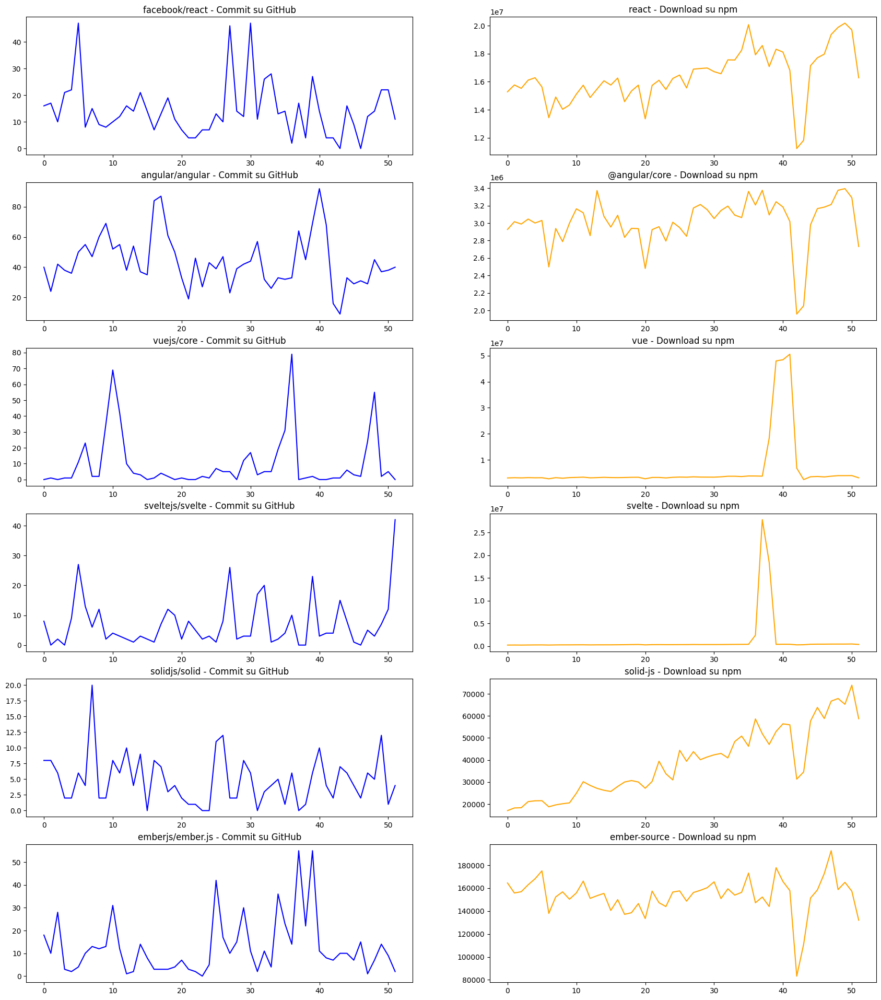
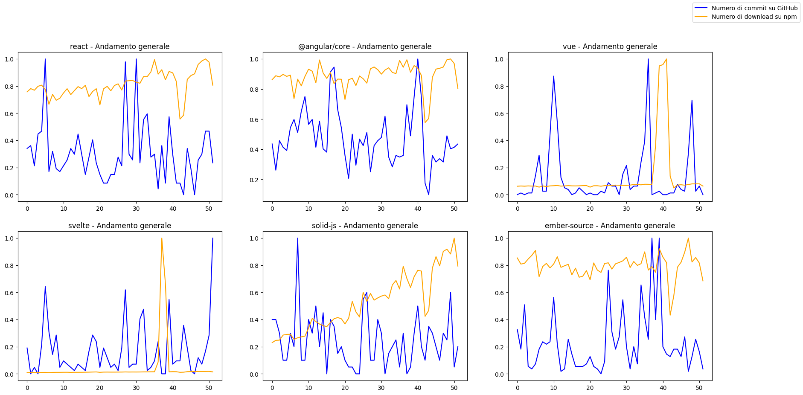

# Tutorial sulle API di GitHub ed npm

Nome: Davide  
Cognome: Barbagallo  
Matricola: 1000016775  
Corso: Social Media Management  
Docente: Antonino Furnari  
Anno accademico: 2022/23  

# Introduzione
### GitHub
GitHub è un servizio di hosting di progetti software che usa come [version control system](https://it.wikipedia.org/wiki/Controllo_versione_distribuito) Git.  
Nata come azienda indipendente, nel 2018 è stata acquisita da Microsoft.

All'interno, gli utenti possono registrarsi e creare della **repository**, con visibilità pubblica o privata, in cui è possibile caricare il codice sorgente di un applicativo. Le repository sono organizzate in **branch**, di cui una principale, chiamata *main* o *master*, ed altre secondarie, relative all'implementazione di una nuova feature oppure alla risoluzione di un bug. Branch diverse hanno generalmente codice diverso.
È anche possibile creare delle **issue**, topic in cui utenti discutono di un determinato problema del codice. Una volta discusso, gli sviluppatori possono aprire una **pull request** collegata alla issue, richiedendo il *merge* del codice relativo alla branch associata alla pull request dentro la branch principale.  
Di recente, GitHub ha aggiunto la possibilità di associare a determinati comandi Git delle azioni, chiamate *GitHub Actions*, che agevolano il flusso di lavoro come la compilazione e la distribuzione dell'applicativo legato alla repository.

### npm
Node Package Manager, abbreviato npm, è il gestore di pacchetti ufficiale dell'ambiente JavaScript Node.js.

All'interno, gli utenti possono scaricare i **pacchetti** pubblicati attraverso un tool da linea di comando ed utilizzarli all'interno di progetti Node.js.  
I pacchetti, pubblici e privati, sono conservati all'interno di un **database** online. Ogni pacchetto ha dedicata una pagina all'interno del sito [npmjs.com](https://www.npmjs.com/) in modo che gli utenti interessati possono visualizzarne i dettagli, come il README.md, generalmente contenente lo scopo del pacchetto e la sua guida all'installazione, il numero di download settimanali ed i creatori del pacchetto, chiamati **maintainers**.  
Tutti gli sviluppatori JavaScript possono creare e pubblicare un pacchetto all'interno di npm.

### Link utili
- [Documentazione API su GitHub](https://docs.github.com/en/rest)
- [Documentazione API su npm](https://github.com/npm/registry)


### Obbiettivo
L'obbiettivo del tutorial è studiare se esiste una correlazione fra il numero di commit settimanali su GitHub ed il numero di download settimanali su npm, cioè di verificare dunque se, una libreria mantenuta e curata riceve più download di una libreria meno curata.  
Prenderemo in esame una specifica *"classe"* di pacchetti, in particolari i framework utilizzati per la generazione di [Single Page Application](https://it.wikipedia.org/wiki/Single-page_application).  
In particolare esamineremo i seguenti pacchetti:
- React: [GitHub](https://github.com/facebook/react) - [npm](https://www.npmjs.com/package/react)
- Angular: [GitHub](https://github.com/angular/angular) - [npm](https://www.npmjs.com/package/@angular/core)
- Vue: [GitHub](https://github.com/vuejs/core) - [npm](https://www.npmjs.com/package/vue)
- Svelte: [GitHub](https://github.com/sveltejs/svelte) - [npm](https://www.npmjs.com/package/svelte)
- Solid: [GitHub](https://github.com/solidjs/solid) - [npm](https://www.npmjs.com/package/solid-js)
- Ember: [GitHub](https://github.com/emberjs/ember.js) - [npm](https://www.npmjs.com/package/ember-source)

# Autenticazione
L'**autenticazione** è un meccanismo di protezione dei dati che impedisce ad utenti non autorizzati di accedere a dati privati.  
Per identificare l'utente, viene utilizzato un **token**, generato in fase di **autenticazione** in cui l'utente si identifica con le sue credenziali.  
Successivamente, nelle richieste che verranno inviate alle API, il token generato viene allegato negli header della richiesta. Viene quindi controllato dal server che verifica se l'utente collegato al token è **autorizzato** ad accedere alla risorsa su cui è stata fatta la richiesta.

### GitHub
Come riporta la [documentazione di GitHub](https://docs.github.com/en/rest/guides/getting-started-with-the-rest-api), per l'utilizzo delle API è necessario essere **autenticati**.  
La piattaforma ci permette di utilizzare diversi metodi per poter generare un token di autenticazione, a seconda della complessità del sistema software che deve usare le API:
- GitHub Apps
- OAuth Apps
- Personal access tokens

Nel nostro caso, la nostra applicazione non ha i requisiti per poter utilizzare le GitHub Apps (servono per creare estensioni di GitHub, come client desktop) oppure le OAuth Apps (esse seguono il paradigma web e quindi non sono utilizzabili nel nostro caso).  
L'unica alternativa possibile sono i **personal access token**.  
GitHub utilizza dei token chiamati **fine-grained personal access tokens** che ci permettono di definire, in fase di generazione, le azioni che gli utenti in possesso del token possono svolgere.

Per la creazione di un token, andiamo sulla home di [GitHub](https://github.com/).  
In alto, accediamo al nostro account se ne abbiamo già uno, oppure registriamoci:  


GitHub ci guiderà attraverso dei form ed arriveremo sulla home del nostro profilo GitHub.  
Tramite il menù in alto a destra, spostiamoci nella sezione **Settings**.  


Tramite il menù di navigazione sulla sinistra, spostiamoci nella sezione **Developer Settings**.  


Utilizzando il menù, andiamo nella sezione **Personal access tokens -> Fine-grained personal access tokens**.  


Arriveremo nella schermata interessata per gestione dei token personali.  


Cliccando su **Generate new token**, ci ritroveremo in questa schermata:


Noteremo i seguenti campi da compilare:
- **Token name**: nome del token. Lo useremo per distinguerlo dagli altri.
- **Expiration**: scadenza del token. Superata questa data, il token non permetterà di fare nessuna richiesta.
- **Description (opzionale)**: descrizione dello scopo del token.
- **Resource owner**: il proprietario del token. Corrisponde all'account che stiamo usando per generare il token. Nel caso in cui l'utente faccia parte di organizzazioni, esse potranno comparire fra le opzioni.
- **Repository access**: repository pubbliche e private a cui il token ci permette di accedere. Nel nostro caso, analizzeremo solo repo pubbliche, quindi lo impostiamo a *Public Repositories (read-only)*.
- **Permissions**: azioni permesse che gli utenti in possesso del token possono svolgere, come le interazioni con altri utenti. Di default, tutte le azioni sono impostate su *No access*. Nel nostro caso, non abbiamo bisogno di svolgere particolari azioni e possiamo quindi lasciare tutto com'è.

Compilato, il nostro form avrà questa struttura:


Cliccando su **Generate Token**, ci ritroveremo in questa schermata:


Da notare che GitHub ci segnala che avremo accesso al token **solo una volta**. Una volta cambiata pagina, non sarà più possibile accedervi e dovremo generarne uno nuovo.  
Una volta inserito all'interno del sistema software, dovremmo allegarlo come **Header** della richiesta nella voce **Authorization**, in questo modo:
```
Authorization: Bearer <GITHUB-TOKEN>
```
Nel nostro caso, i token sono gestiti all'interno di un file `.env`, file utilizzati per gestire le variabili d'ambiente in un sistema software.  
Utilizziamo il file `.env.example` come struttura per creare il file `.env`.  
Copiamo il file `.env.example` e rinominiamolo in `.env`.  
Una volta generato il token, concateniamolo alla variabile d'ambiente `ACCESS_TOKEN`.  

### npm
A differenza di GitHub, le API di npm sono ad accesso libero e non necessitano alcun tipo di autenticazione.

# Utilizzo delle API

### GitHub
Per estrarre il numero di commit settimanali da una repository, usiamo l'API [get-the-weekly-commit-count](https://docs.github.com/en/rest/metrics/statistics#get-the-weekly-commit-count).  
Dato in input il proprietario della repo ed il nome della repo, essa ritorna un oggetto con due proprietà:
- `all`, un array di numeri di 52 elementi, ognuno indicante il numero totali di commit svolti in una settimana da tutti i collaboratori alla repository nell'ultimo anno.
- `owner`, un array di numeri di 52 elementi, ognuno indicante il numero totali di commit svolti in una settimana solo dal creatore della repository nell'ultimo anno.

Questa suddivisione in due array ci permette di poter ricavare:
- il numero totale di commit settimanali.
- il numero totale di commit settimanali fatti dal proprietario della repository.
- il numero totale di commit settimanali fatti dai collaboratori della repository, ottenibili sottraendo ai commit totali, i commit del proprietario.

A noi interessano solo i commit totali, perciò considereremo solo il campo `all`.

Iniziamo definendo la funzione per chiamare l'API di GitHub interessata:


```python
import os

import dotenv
import requests

dotenv.load_dotenv()

def get_github_stats(owner: str, name: str):
    url_request = 'https://api.github.com/repos/{}/{}/stats/participation'.format(owner, name)
    headers = { 'Authorization': 'Bearer {}'.format(os.getenv('ACCESS_TOKEN')), 'accept': 'application/vnd.github+json' }
    response = requests.get(url_request, headers=headers)
    data = response.json()
    return data
```

Definiamo i dati di input necessari:


```python
github_repo_owners = ['facebook', 'angular', 'vuejs', 'sveltejs', 'solidjs', 'emberjs']
github_repo_names = ['react', 'angular', 'core', 'svelte', 'solid', 'ember.js']
github_data_input = zip(github_repo_owners, github_repo_names)
```

Procediamo, prelevando per ogni coppia generata i dati dalle API:


```python
github_data_output = list()

for (owner, name) in github_data_input:
    response = get_github_stats(owner, name)
    github_data_output.append(response)
    
github_data_output
```


    [{'all': [16,
       17,
       10,
       21,
       22,
       47,
       8,
       15,
       9,
       8,
       10,
       12,
       16,
       14,
       21,
       14,
       7,
       13,
       19,
       11,
       7,
       4,
       4,
       7,
       7,
       13,
       10,
       46,
       14,
       12,
       47,
       11,
       26,
       28,
       13,
       14,
       2,
       17,
       4,
       27,
       14,
       4,
       4,
       0,
       16,
       9,
       0,
       12,
       14,
       22,
       22,
       11],
      'owner': [0,
       0,
       0,
       0,
       0,
       0,
       0,
       0,
       0,
       0,
       0,
       0,
       0,
       0,
       0,
       0,
       0,
       0,
       0,
       0,
       0,
       0,
       0,
       0,
       0,
       0,
       0,
       0,
       0,
       0,
       0,
       0,
       0,
       0,
       0,
       0,
       0,
       0,
       0,
       0,
       0,
       0,
       0,
       0,
       0,
       0,
       0,
       0,
       0,
       0,
       0,
       0]},
     {'all': [40,
       24,
       42,
       38,
       36,
       50,
       55,
       47,
       60,
       69,
       52,
       55,
       38,
       54,
       37,
       35,
       84,
       87,
       61,
       50,
       33,
       19,
       46,
       27,
       43,
       39,
       47,
       23,
       39,
       42,
       44,
       57,
       32,
       26,
       33,
       32,
       33,
       64,
       45,
       69,
       92,
       68,
       16,
       9,
       33,
       29,
       31,
       29,
       45,
       37,
       38,
       40],
      'owner': [0,
       0,
       0,
       0,
       0,
       0,
       0,
       0,
       0,
       0,
       0,
       0,
       0,
       0,
       0,
       0,
       0,
       0,
       0,
       0,
       0,
       0,
       0,
       0,
       0,
       0,
       0,
       0,
       0,
       0,
       0,
       0,
       0,
       0,
       0,
       0,
       0,
       0,
       0,
       0,
       0,
       0,
       0,
       0,
       0,
       0,
       0,
       0,
       0,
       0,
       0,
       0]},
     {'all': [0,
       1,
       0,
       1,
       1,
       11,
       23,
       2,
       2,
       35,
       69,
       42,
       10,
       4,
       3,
       0,
       1,
       4,
       2,
       0,
       1,
       0,
       0,
       2,
       1,
       7,
       5,
       5,
       0,
       12,
       17,
       3,
       5,
       5,
       19,
       31,
       79,
       0,
       1,
       2,
       0,
       0,
       1,
       1,
       6,
       3,
       2,
       24,
       55,
       2,
       5,
       0],
      'owner': [0,
       0,
       0,
       0,
       0,
       0,
       0,
       0,
       0,
       0,
       0,
       0,
       0,
       0,
       0,
       0,
       0,
       0,
       0,
       0,
       0,
       0,
       0,
       0,
       0,
       0,
       0,
       0,
       0,
       0,
       0,
       0,
       0,
       0,
       0,
       0,
       0,
       0,
       0,
       0,
       0,
       0,
       0,
       0,
       0,
       0,
       0,
       0,
       0,
       0,
       0,
       0]},
     {'all': [8,
       0,
       2,
       0,
       9,
       27,
       13,
       6,
       12,
       2,
       4,
       3,
       2,
       1,
       3,
       2,
       1,
       7,
       12,
       10,
       2,
       8,
       5,
       2,
       3,
       1,
       8,
       26,
       2,
       3,
       3,
       17,
       20,
       1,
       2,
       4,
       10,
       0,
       0,
       23,
       3,
       4,
       4,
       15,
       8,
       1,
       0,
       5,
       3,
       7,
       12,
       42],
      'owner': [0,
       0,
       0,
       0,
       0,
       0,
       0,
       0,
       0,
       0,
       0,
       0,
       0,
       0,
       0,
       0,
       0,
       0,
       0,
       0,
       0,
       0,
       0,
       0,
       0,
       0,
       0,
       0,
       0,
       0,
       0,
       0,
       0,
       0,
       0,
       0,
       0,
       0,
       0,
       0,
       0,
       0,
       0,
       0,
       0,
       0,
       0,
       0,
       0,
       0,
       0,
       0]},
     {'all': [8,
       8,
       6,
       2,
       2,
       6,
       4,
       20,
       2,
       2,
       8,
       6,
       10,
       4,
       9,
       0,
       8,
       7,
       3,
       4,
       2,
       1,
       1,
       0,
       0,
       11,
       12,
       2,
       2,
       8,
       6,
       0,
       3,
       4,
       5,
       1,
       6,
       0,
       1,
       6,
       10,
       4,
       2,
       7,
       6,
       4,
       2,
       6,
       5,
       12,
       1,
       4],
      'owner': [0,
       0,
       0,
       0,
       0,
       0,
       0,
       0,
       0,
       0,
       0,
       0,
       0,
       0,
       0,
       0,
       0,
       0,
       0,
       0,
       0,
       0,
       0,
       0,
       0,
       0,
       0,
       0,
       0,
       0,
       0,
       0,
       0,
       0,
       0,
       0,
       0,
       0,
       0,
       0,
       0,
       0,
       0,
       0,
       0,
       0,
       0,
       0,
       0,
       0,
       0,
       0]},
     {'all': [18,
       10,
       28,
       3,
       2,
       4,
       10,
       13,
       12,
       13,
       31,
       12,
       1,
       2,
       14,
       8,
       3,
       3,
       3,
       4,
       7,
       3,
       2,
       0,
       5,
       42,
       17,
       10,
       15,
       30,
       11,
       2,
       11,
       4,
       36,
       23,
       14,
       55,
       22,
       55,
       11,
       8,
       7,
       10,
       10,
       7,
       15,
       1,
       7,
       14,
       9,
       2],
      'owner': [0,
       0,
       0,
       0,
       0,
       0,
       0,
       0,
       0,
       0,
       0,
       0,
       0,
       0,
       0,
       0,
       0,
       0,
       0,
       0,
       0,
       0,
       0,
       0,
       0,
       0,
       0,
       0,
       0,
       0,
       0,
       0,
       0,
       0,
       0,
       0,
       0,
       0,
       0,
       0,
       0,
       0,
       0,
       0,
       0,
       0,
       0,
       0,
       0,
       0,
       0,
       0]}]


Rimuoviamo i dati non necessari per l'analisi, scartando il campo `owner` dalle risposte:


```python
github_data = list(map(lambda element : element['all'], github_data_output))

github_data
```


    [[16,
      17,
      10,
      21,
      22,
      47,
      8,
      15,
      9,
      8,
      10,
      12,
      16,
      14,
      21,
      14,
      7,
      13,
      19,
      11,
      7,
      4,
      4,
      7,
      7,
      13,
      10,
      46,
      14,
      12,
      47,
      11,
      26,
      28,
      13,
      14,
      2,
      17,
      4,
      27,
      14,
      4,
      4,
      0,
      16,
      9,
      0,
      12,
      14,
      22,
      22,
      11],
     [40,
      24,
      42,
      38,
      36,
      50,
      55,
      47,
      60,
      69,
      52,
      55,
      38,
      54,
      37,
      35,
      84,
      87,
      61,
      50,
      33,
      19,
      46,
      27,
      43,
      39,
      47,
      23,
      39,
      42,
      44,
      57,
      32,
      26,
      33,
      32,
      33,
      64,
      45,
      69,
      92,
      68,
      16,
      9,
      33,
      29,
      31,
      29,
      45,
      37,
      38,
      40],
     [0,
      1,
      0,
      1,
      1,
      11,
      23,
      2,
      2,
      35,
      69,
      42,
      10,
      4,
      3,
      0,
      1,
      4,
      2,
      0,
      1,
      0,
      0,
      2,
      1,
      7,
      5,
      5,
      0,
      12,
      17,
      3,
      5,
      5,
      19,
      31,
      79,
      0,
      1,
      2,
      0,
      0,
      1,
      1,
      6,
      3,
      2,
      24,
      55,
      2,
      5,
      0],
     [8,
      0,
      2,
      0,
      9,
      27,
      13,
      6,
      12,
      2,
      4,
      3,
      2,
      1,
      3,
      2,
      1,
      7,
      12,
      10,
      2,
      8,
      5,
      2,
      3,
      1,
      8,
      26,
      2,
      3,
      3,
      17,
      20,
      1,
      2,
      4,
      10,
      0,
      0,
      23,
      3,
      4,
      4,
      15,
      8,
      1,
      0,
      5,
      3,
      7,
      12,
      42],
     [8,
      8,
      6,
      2,
      2,
      6,
      4,
      20,
      2,
      2,
      8,
      6,
      10,
      4,
      9,
      0,
      8,
      7,
      3,
      4,
      2,
      1,
      1,
      0,
      0,
      11,
      12,
      2,
      2,
      8,
      6,
      0,
      3,
      4,
      5,
      1,
      6,
      0,
      1,
      6,
      10,
      4,
      2,
      7,
      6,
      4,
      2,
      6,
      5,
      12,
      1,
      4],
     [18,
      10,
      28,
      3,
      2,
      4,
      10,
      13,
      12,
      13,
      31,
      12,
      1,
      2,
      14,
      8,
      3,
      3,
      3,
      4,
      7,
      3,
      2,
      0,
      5,
      42,
      17,
      10,
      15,
      30,
      11,
      2,
      11,
      4,
      36,
      23,
      14,
      55,
      22,
      55,
      11,
      8,
      7,
      10,
      10,
      7,
      15,
      1,
      7,
      14,
      9,
      2]]


### npm
Per estrarre il numero di download da un pacchetto, utilizziamo l'API [downloads/range](https://github.com/npm/registry/blob/master/docs/download-counts.md).  
Dato in input il nome del package ed il range di date da esaminare, essa ritorna un oggetto con le seguenti proprietà:`
- `start`: una data indicante l'inizio del range.
- `end`: una data indicante la fine del range.
- `package`: una stringa indicante il nome del pacchetto esaminato.
- `downloads`: un array di oggetti, ognuno rappresentante un giorno specifico ed il numero di download avvenuti quel giorno.

Estraiamo quindi i dati da npm:

Iniziamo definendo la funzione per chiamare l'API di npm, sistemando il range delle date in modo da aver i risultati dell'ultimo anno:


```python
from datetime import date

import requests
from dateutil.relativedelta import relativedelta


def get_npm_stats(package_name: str):
    now = date.today()
    past_years = now - relativedelta(years=1)
    url_request = 'https://api.npmjs.org/downloads/range/{}:{}/{}'.format(past_years, now, package_name)
    response = requests.get(url_request)
    data = response.json()
    return data
```

Definiamo i dati in input:


```python
npm_packages_names = ['react', '@angular/core', 'vue', 'svelte', 'solid-js', 'ember-source']
```

Procediamo prelevando per ogni pacchetto i dati dalle API:


```python
npm_data_output = list()

for package_name in npm_packages_names:
    response = get_npm_stats(package_name)
    npm_data_output.append(response)
    
npm_data_output
```


    [{'start': '2022-03-01',
      'end': '2023-03-01',
      'package': 'react',
      'downloads': [{'downloads': 2859605, 'day': '2022-03-01'},
       {'downloads': 2838973, 'day': '2022-03-02'},
       {'downloads': 2783987, 'day': '2022-03-03'},
       {'downloads': 2489945, 'day': '2022-03-04'},
       {'downloads': 849505, 'day': '2022-03-05'},
       {'downloads': 821241, 'day': '2022-03-06'},
       {'downloads': 2723277, 'day': '2022-03-07'},
       {'downloads': 2778844, 'day': '2022-03-08'},
       {'downloads': 2836479, 'day': '2022-03-09'},
       {'downloads': 2842622, 'day': '2022-03-10'},
       {'downloads': 2527623, 'day': '2022-03-11'},
       {'downloads': 863902, 'day': '2022-03-12'},
       {'downloads': 833587, 'day': '2022-03-13'},
       {'downloads': 2829667, 'day': '2022-03-14'},
       {'downloads': 2952432, 'day': '2022-03-15'},
       {'downloads': 2920872, 'day': '2022-03-16'},
       {'downloads': 2779660, 'day': '2022-03-17'},
       {'downloads': 2418963, 'day': '2022-03-18'},
       {'downloads': 834184, 'day': '2022-03-19'},
       {'downloads': 822952, 'day': '2022-03-20'},
       {'downloads': 2787032, 'day': '2022-03-21'},
       {'downloads': 2920495, 'day': '2022-03-22'},
       {'downloads': 2965178, 'day': '2022-03-23'},
       {'downloads': 2893533, 'day': '2022-03-24'},
       {'downloads': 2575596, 'day': '2022-03-25'},
       {'downloads': 861969, 'day': '2022-03-26'},
       {'downloads': 850483, 'day': '2022-03-27'},
       {'downloads': 2867543, 'day': '2022-03-28'},
       {'downloads': 3019997, 'day': '2022-03-29'},
       {'downloads': 3046894, 'day': '2022-03-30'},
       {'downloads': 2993957, 'day': '2022-03-31'},
       {'downloads': 2751250, 'day': '2022-04-01'},
       {'downloads': 867625, 'day': '2022-04-02'},
       {'downloads': 860117, 'day': '2022-04-03'},
       {'downloads': 2900325, 'day': '2022-04-04'},
       {'downloads': 2978449, 'day': '2022-04-05'},
       {'downloads': 2933422, 'day': '2022-04-06'},
       {'downloads': 2957444, 'day': '2022-04-07'},
       {'downloads': 2458784, 'day': '2022-04-08'},
       {'downloads': 731541, 'day': '2022-04-09'},
       {'downloads': 646011, 'day': '2022-04-10'},
       {'downloads': 2773044, 'day': '2022-04-11'},
       {'downloads': 3271474, 'day': '2022-04-12'},
       {'downloads': 2792857, 'day': '2022-04-13'},
       {'downloads': 2869909, 'day': '2022-04-14'},
       {'downloads': 1712928, 'day': '2022-04-15'},
       {'downloads': 599468, 'day': '2022-04-16'},
       {'downloads': 584059, 'day': '2022-04-17'},
       {'downloads': 1969144, 'day': '2022-04-18'},
       {'downloads': 2798056, 'day': '2022-04-19'},
       {'downloads': 2900984, 'day': '2022-04-20'},
       {'downloads': 2860117, 'day': '2022-04-21'},
       {'downloads': 2374065, 'day': '2022-04-22'},
       {'downloads': 611518, 'day': '2022-04-23'},
       {'downloads': 634758, 'day': '2022-04-24'},
       {'downloads': 2613039, 'day': '2022-04-25'},
       {'downloads': 2945479, 'day': '2022-04-26'},
       {'downloads': 2872307, 'day': '2022-04-27'},
       {'downloads': 2830796, 'day': '2022-04-28'},
       {'downloads': 2480447, 'day': '2022-04-29'},
       {'downloads': 645207, 'day': '2022-04-30'},
       {'downloads': 757733, 'day': '2022-05-01'},
       {'downloads': 2263005, 'day': '2022-05-02'},
       {'downloads': 2461542, 'day': '2022-05-03'},
       {'downloads': 2598864, 'day': '2022-05-04'},
       {'downloads': 2547887, 'day': '2022-05-05'},
       {'downloads': 2331844, 'day': '2022-05-06'},
       {'downloads': 642727, 'day': '2022-05-07'},
       {'downloads': 480074, 'day': '2022-05-08'},
       {'downloads': 2654906, 'day': '2022-05-09'},
       {'downloads': 2857690, 'day': '2022-05-10'},
       {'downloads': 2826352, 'day': '2022-05-11'},
       {'downloads': 2747875, 'day': '2022-05-12'},
       {'downloads': 2409143, 'day': '2022-05-13'},
       {'downloads': 618384, 'day': '2022-05-14'},
       {'downloads': 640859, 'day': '2022-05-15'},
       {'downloads': 2763270, 'day': '2022-05-16'},
       {'downloads': 2976129, 'day': '2022-05-17'},
       {'downloads': 2961494, 'day': '2022-05-18'},
       {'downloads': 2962225, 'day': '2022-05-19'},
       {'downloads': 2572509, 'day': '2022-05-20'},
       {'downloads': 654163, 'day': '2022-05-21'},
       {'downloads': 696941, 'day': '2022-05-22'},
       {'downloads': 2806246, 'day': '2022-05-23'},
       {'downloads': 3043428, 'day': '2022-05-24'},
       {'downloads': 3017545, 'day': '2022-05-25'},
       {'downloads': 2686778, 'day': '2022-05-26'},
       {'downloads': 2355462, 'day': '2022-05-27'},
       {'downloads': 659831, 'day': '2022-05-28'},
       {'downloads': 713721, 'day': '2022-05-29'},
       {'downloads': 2459147, 'day': '2022-05-30'},
       {'downloads': 2928783, 'day': '2022-05-31'},
       {'downloads': 3072771, 'day': '2022-06-01'},
       {'downloads': 2806929, 'day': '2022-06-02'},
       {'downloads': 2486378, 'day': '2022-06-03'},
       {'downloads': 723933, 'day': '2022-06-04'},
       {'downloads': 668177, 'day': '2022-06-05'},
       {'downloads': 2622558, 'day': '2022-06-06'},
       {'downloads': 3075566, 'day': '2022-06-07'},
       {'downloads': 3092451, 'day': '2022-06-08'},
       {'downloads': 2988703, 'day': '2022-06-09'},
       {'downloads': 2580564, 'day': '2022-06-10'},
       {'downloads': 726045, 'day': '2022-06-11'},
       {'downloads': 705679, 'day': '2022-06-12'},
       {'downloads': 2838331, 'day': '2022-06-13'},
       {'downloads': 3099547, 'day': '2022-06-14'},
       {'downloads': 3128590, 'day': '2022-06-15'},
       {'downloads': 2902850, 'day': '2022-06-16'},
       {'downloads': 2512350, 'day': '2022-06-17'},
       {'downloads': 767485, 'day': '2022-06-18'},
       {'downloads': 769642, 'day': '2022-06-19'},
       {'downloads': 2713401, 'day': '2022-06-20'},
       {'downloads': 3021173, 'day': '2022-06-21'},
       {'downloads': 3077642, 'day': '2022-06-22'},
       {'downloads': 3090450, 'day': '2022-06-23'},
       {'downloads': 2561102, 'day': '2022-06-24'},
       {'downloads': 767424, 'day': '2022-06-25'},
       {'downloads': 740380, 'day': '2022-06-26'},
       {'downloads': 2951872, 'day': '2022-06-27'},
       {'downloads': 3114726, 'day': '2022-06-28'},
       {'downloads': 3036520, 'day': '2022-06-29'},
       {'downloads': 2937535, 'day': '2022-06-30'},
       {'downloads': 2421008, 'day': '2022-07-01'},
       {'downloads': 668888, 'day': '2022-07-02'},
       {'downloads': 673220, 'day': '2022-07-03'},
       {'downloads': 2245633, 'day': '2022-07-04'},
       {'downloads': 2758180, 'day': '2022-07-05'},
       {'downloads': 2876031, 'day': '2022-07-06'},
       {'downloads': 2845126, 'day': '2022-07-07'},
       {'downloads': 2467046, 'day': '2022-07-08'},
       {'downloads': 658563, 'day': '2022-07-09'},
       {'downloads': 666030, 'day': '2022-07-10'},
       {'downloads': 2808372, 'day': '2022-07-11'},
       {'downloads': 2943264, 'day': '2022-07-12'},
       {'downloads': 2949223, 'day': '2022-07-13'},
       {'downloads': 2861338, 'day': '2022-07-14'},
       {'downloads': 2520015, 'day': '2022-07-15'},
       {'downloads': 672442, 'day': '2022-07-16'},
       {'downloads': 676018, 'day': '2022-07-17'},
       {'downloads': 2842600, 'day': '2022-07-18'},
       {'downloads': 3053027, 'day': '2022-07-19'},
       {'downloads': 3131721, 'day': '2022-07-20'},
       {'downloads': 3057311, 'day': '2022-07-21'},
       {'downloads': 0, 'day': '2022-07-22'},
       {'downloads': 683573, 'day': '2022-07-23'},
       {'downloads': 676300, 'day': '2022-07-24'},
       {'downloads': 2909601, 'day': '2022-07-25'},
       {'downloads': 3059480, 'day': '2022-07-26'},
       {'downloads': 2967092, 'day': '2022-07-27'},
       {'downloads': 2949453, 'day': '2022-07-28'},
       {'downloads': 2532241, 'day': '2022-07-29'},
       {'downloads': 687490, 'day': '2022-07-30'},
       {'downloads': 689364, 'day': '2022-07-31'},
       {'downloads': 2875954, 'day': '2022-08-01'},
       {'downloads': 3020315, 'day': '2022-08-02'},
       {'downloads': 2984469, 'day': '2022-08-03'},
       {'downloads': 2961413, 'day': '2022-08-04'},
       {'downloads': 2570755, 'day': '2022-08-05'},
       {'downloads': 685502, 'day': '2022-08-06'},
       {'downloads': 707400, 'day': '2022-08-07'},
       {'downloads': 2995533, 'day': '2022-08-08'},
       {'downloads': 3173205, 'day': '2022-08-09'},
       {'downloads': 3012226, 'day': '2022-08-10'},
       {'downloads': 2910441, 'day': '2022-08-11'},
       {'downloads': 2492563, 'day': '2022-08-12'},
       {'downloads': 712441, 'day': '2022-08-13'},
       {'downloads': 712456, 'day': '2022-08-14'},
       {'downloads': 2495204, 'day': '2022-08-15'},
       {'downloads': 3069346, 'day': '2022-08-16'},
       {'downloads': 3056165, 'day': '2022-08-17'},
       {'downloads': 2948496, 'day': '2022-08-18'},
       {'downloads': 2601999, 'day': '2022-08-19'},
       {'downloads': 691630, 'day': '2022-08-20'},
       {'downloads': 710906, 'day': '2022-08-21'},
       {'downloads': 2994413, 'day': '2022-08-22'},
       {'downloads': 3185287, 'day': '2022-08-23'},
       {'downloads': 3102061, 'day': '2022-08-24'},
       {'downloads': 3120754, 'day': '2022-08-25'},
       {'downloads': 2688595, 'day': '2022-08-26'},
       {'downloads': 737705, 'day': '2022-08-27'},
       {'downloads': 745024, 'day': '2022-08-28'},
       {'downloads': 2865858, 'day': '2022-08-29'},
       {'downloads': 3201542, 'day': '2022-08-30'},
       {'downloads': 3119916, 'day': '2022-08-31'},
       {'downloads': 3158240, 'day': '2022-09-01'},
       {'downloads': 2548791, 'day': '2022-09-02'},
       {'downloads': 669021, 'day': '2022-09-03'},
       {'downloads': 670663, 'day': '2022-09-04'},
       {'downloads': 2358653, 'day': '2022-09-05'},
       {'downloads': 3069215, 'day': '2022-09-06'},
       {'downloads': 3083367, 'day': '2022-09-07'},
       {'downloads': 3113142, 'day': '2022-09-08'},
       {'downloads': 2711228, 'day': '2022-09-09'},
       {'downloads': 712270, 'day': '2022-09-10'},
       {'downloads': 719501, 'day': '2022-09-11'},
       {'downloads': 3102553, 'day': '2022-09-12'},
       {'downloads': 3316214, 'day': '2022-09-13'},
       {'downloads': 3224663, 'day': '2022-09-14'},
       {'downloads': 3169534, 'day': '2022-09-15'},
       {'downloads': 2752059, 'day': '2022-09-16'},
       {'downloads': 753442, 'day': '2022-09-17'},
       {'downloads': 770190, 'day': '2022-09-18'},
       {'downloads': 2963648, 'day': '2022-09-19'},
       {'downloads': 3385992, 'day': '2022-09-20'},
       {'downloads': 3148606, 'day': '2022-09-21'},
       {'downloads': 3087291, 'day': '2022-09-22'},
       {'downloads': 2687118, 'day': '2022-09-23'},
       {'downloads': 699596, 'day': '2022-09-24'},
       {'downloads': 691095, 'day': '2022-09-25'},
       {'downloads': 3187063, 'day': '2022-09-26'},
       {'downloads': 3258365, 'day': '2022-09-27'},
       {'downloads': 3369464, 'day': '2022-09-28'},
       {'downloads': 3219156, 'day': '2022-09-29'},
       {'downloads': 2783137, 'day': '2022-09-30'},
       {'downloads': 803132, 'day': '2022-10-01'},
       {'downloads': 698212, 'day': '2022-10-02'},
       {'downloads': 2918951, 'day': '2022-10-03'},
       {'downloads': 3222985, 'day': '2022-10-04'},
       {'downloads': 3074340, 'day': '2022-10-05'},
       {'downloads': 3180651, 'day': '2022-10-06'},
       {'downloads': 2777546, 'day': '2022-10-07'},
       {'downloads': 748101, 'day': '2022-10-08'},
       {'downloads': 725507, 'day': '2022-10-09'},
       {'downloads': 2726581, 'day': '2022-10-10'},
       {'downloads': 3251759, 'day': '2022-10-11'},
       {'downloads': 3159652, 'day': '2022-10-12'},
       {'downloads': 3235993, 'day': '2022-10-13'},
       {'downloads': 2885177, 'day': '2022-10-14'},
       {'downloads': 764937, 'day': '2022-10-15'},
       {'downloads': 723292, 'day': '2022-10-16'},
       {'downloads': 3238028, 'day': '2022-10-17'},
       {'downloads': 3358615, 'day': '2022-10-18'},
       {'downloads': 3354660, 'day': '2022-10-19'},
       {'downloads': 3305595, 'day': '2022-10-20'},
       {'downloads': 2943028, 'day': '2022-10-21'},
       {'downloads': 834978, 'day': '2022-10-22'},
       {'downloads': 759192, 'day': '2022-10-23'},
       {'downloads': 3086367, 'day': '2022-10-24'},
       {'downloads': 3327549, 'day': '2022-10-25'},
       {'downloads': 3294062, 'day': '2022-10-26'},
       {'downloads': 3402347, 'day': '2022-10-27'},
       {'downloads': 2914239, 'day': '2022-10-28'},
       {'downloads': 862265, 'day': '2022-10-29'},
       {'downloads': 842678, 'day': '2022-10-30'},
       {'downloads': 3127134, 'day': '2022-10-31'},
       {'downloads': 3483471, 'day': '2022-11-01'},
       {'downloads': 3616999, 'day': '2022-11-02'},
       {'downloads': 3595913, 'day': '2022-11-03'},
       {'downloads': 3170353, 'day': '2022-11-04'},
       {'downloads': 1186151, 'day': '2022-11-05'},
       {'downloads': 1179707, 'day': '2022-11-06'},
       {'downloads': 3619210, 'day': '2022-11-07'},
       {'downloads': 3877649, 'day': '2022-11-08'},
       {'downloads': 3442852, 'day': '2022-11-09'},
       {'downloads': 3347527, 'day': '2022-11-10'},
       {'downloads': 2594331, 'day': '2022-11-11'},
       {'downloads': 789247, 'day': '2022-11-12'},
       {'downloads': 822343, 'day': '2022-11-13'},
       {'downloads': 3290362, 'day': '2022-11-14'},
       {'downloads': 3511478, 'day': '2022-11-15'},
       {'downloads': 3567083, 'day': '2022-11-16'},
       {'downloads': 3528121, 'day': '2022-11-17'},
       {'downloads': 3054601, 'day': '2022-11-18'},
       {'downloads': 928804, 'day': '2022-11-19'},
       {'downloads': 1158570, 'day': '2022-11-20'},
       {'downloads': 3266999, 'day': '2022-11-21'},
       {'downloads': 3448729, 'day': '2022-11-22'},
       {'downloads': 3196433, 'day': '2022-11-23'},
       {'downloads': 2680195, 'day': '2022-11-24'},
       {'downloads': 2322088, 'day': '2022-11-25'},
       {'downloads': 790030, 'day': '2022-11-26'},
       {'downloads': 856353, 'day': '2022-11-27'},
       {'downloads': 3305577, 'day': '2022-11-28'},
       {'downloads': 3642995, 'day': '2022-11-29'},
       {'downloads': 3485203, 'day': '2022-11-30'},
       {'downloads': 3423998, 'day': '2022-12-01'},
       {'downloads': 2953518, 'day': '2022-12-02'},
       {'downloads': 827954, 'day': '2022-12-03'},
       {'downloads': 844130, 'day': '2022-12-04'},
       {'downloads': 3313020, 'day': '2022-12-05'},
       {'downloads': 3486221, 'day': '2022-12-06'},
       {'downloads': 3469132, 'day': '2022-12-07'},
       {'downloads': 3352912, 'day': '2022-12-08'},
       {'downloads': 2867189, 'day': '2022-12-09'},
       {'downloads': 865738, 'day': '2022-12-10'},
       {'downloads': 883533, 'day': '2022-12-11'},
       {'downloads': 3298908, 'day': '2022-12-12'},
       {'downloads': 3432354, 'day': '2022-12-13'},
       {'downloads': 3414382, 'day': '2022-12-14'},
       {'downloads': 3320285, 'day': '2022-12-15'},
       {'downloads': 2821011, 'day': '2022-12-16'},
       {'downloads': 808877, 'day': '2022-12-17'},
       {'downloads': 785330, 'day': '2022-12-18'},
       {'downloads': 3010360, 'day': '2022-12-19'},
       {'downloads': 3107251, 'day': '2022-12-20'},
       {'downloads': 2963262, 'day': '2022-12-21'},
       {'downloads': 2764043, 'day': '2022-12-22'},
       {'downloads': 2053858, 'day': '2022-12-23'},
       {'downloads': 681860, 'day': '2022-12-24'},
       {'downloads': 657215, 'day': '2022-12-25'},
       {'downloads': 1432752, 'day': '2022-12-26'},
       {'downloads': 1795013, 'day': '2022-12-27'},
       {'downloads': 1851645, 'day': '2022-12-28'},
       {'downloads': 1760066, 'day': '2022-12-29'},
       {'downloads': 1409488, 'day': '2022-12-30'},
       {'downloads': 603157, 'day': '2022-12-31'},
       {'downloads': 732600, 'day': '2023-01-01'},
       {'downloads': 1573559, 'day': '2023-01-02'},
       {'downloads': 2738656, 'day': '2023-01-03'},
       {'downloads': 3005693, 'day': '2023-01-04'},
       {'downloads': 2982066, 'day': '2023-01-05'},
       {'downloads': 2555198, 'day': '2023-01-06'},
       {'downloads': 838094, 'day': '2023-01-07'},
       {'downloads': 823305, 'day': '2023-01-08'},
       {'downloads': 3185262, 'day': '2023-01-09'},
       {'downloads': 3354752, 'day': '2023-01-10'},
       {'downloads': 3404629, 'day': '2023-01-11'},
       {'downloads': 3385837, 'day': '2023-01-12'},
       {'downloads': 2993598, 'day': '2023-01-13'},
       {'downloads': 833672, 'day': '2023-01-14'},
       {'downloads': 868986, 'day': '2023-01-15'},
       {'downloads': 2854358, 'day': '2023-01-16'},
       {'downloads': 3358980, 'day': '2023-01-17'},
       {'downloads': 3413768, 'day': '2023-01-18'},
       {'downloads': 3331532, 'day': '2023-01-19'},
       {'downloads': 2938320, 'day': '2023-01-20'},
       {'downloads': 870690, 'day': '2023-01-21'},
       {'downloads': 856802, 'day': '2023-01-22'},
       {'downloads': 3215347, 'day': '2023-01-23'},
       {'downloads': 3345218, 'day': '2023-01-24'},
       {'downloads': 3409834, 'day': '2023-01-25'},
       {'downloads': 3222321, 'day': '2023-01-26'},
       {'downloads': 3027339, 'day': '2023-01-27'},
       {'downloads': 955000, 'day': '2023-01-28'},
       {'downloads': 1097222, 'day': '2023-01-29'},
       {'downloads': 3542657, 'day': '2023-01-30'},
       {'downloads': 3720196, 'day': '2023-01-31'},
       {'downloads': 3804395, 'day': '2023-02-01'},
       {'downloads': 3616693, 'day': '2023-02-02'},
       {'downloads': 3188900, 'day': '2023-02-03'},
       {'downloads': 1024051, 'day': '2023-02-04'},
       {'downloads': 981537, 'day': '2023-02-05'},
       {'downloads': 3534210, 'day': '2023-02-06'},
       {'downloads': 3802249, 'day': '2023-02-07'},
       {'downloads': 3731851, 'day': '2023-02-08'},
       {'downloads': 3661286, 'day': '2023-02-09'},
       {'downloads': 3290210, 'day': '2023-02-10'},
       {'downloads': 1089725, 'day': '2023-02-11'},
       {'downloads': 1183714, 'day': '2023-02-12'},
       {'downloads': 3624405, 'day': '2023-02-13'},
       {'downloads': 3633714, 'day': '2023-02-14'},
       {'downloads': 3697072, 'day': '2023-02-15'},
       {'downloads': 3677001, 'day': '2023-02-16'},
       {'downloads': 3324659, 'day': '2023-02-17'},
       {'downloads': 1026718, 'day': '2023-02-18'},
       {'downloads': 1000293, 'day': '2023-02-19'},
       {'downloads': 3258716, 'day': '2023-02-20'},
       {'downloads': 3645386, 'day': '2023-02-21'},
       {'downloads': 3761285, 'day': '2023-02-22'},
       {'downloads': 3683466, 'day': '2023-02-23'},
       {'downloads': 3337425, 'day': '2023-02-24'},
       {'downloads': 1034665, 'day': '2023-02-25'},
       {'downloads': 979924, 'day': '2023-02-26'},
       {'downloads': 3582076, 'day': '2023-02-27'},
       {'downloads': 3662451, 'day': '2023-02-28'},
       {'downloads': 0, 'day': '2023-03-01'}]},
     {'start': '2022-03-01',
      'end': '2023-03-01',
      'package': '@angular/core',
      'downloads': [{'downloads': 525990, 'day': '2022-03-01'},
       {'downloads': 580308, 'day': '2022-03-02'},
       {'downloads': 558023, 'day': '2022-03-03'},
       {'downloads': 490433, 'day': '2022-03-04'},
       {'downloads': 113703, 'day': '2022-03-05'},
       {'downloads': 105999, 'day': '2022-03-06'},
       {'downloads': 537500, 'day': '2022-03-07'},
       {'downloads': 550610, 'day': '2022-03-08'},
       {'downloads': 571032, 'day': '2022-03-09'},
       {'downloads': 585747, 'day': '2022-03-10'},
       {'downloads': 499105, 'day': '2022-03-11'},
       {'downloads': 108017, 'day': '2022-03-12'},
       {'downloads': 105958, 'day': '2022-03-13'},
       {'downloads': 552180, 'day': '2022-03-14'},
       {'downloads': 580207, 'day': '2022-03-15'},
       {'downloads': 584461, 'day': '2022-03-16'},
       {'downloads': 569710, 'day': '2022-03-17'},
       {'downloads': 481807, 'day': '2022-03-18'},
       {'downloads': 111118, 'day': '2022-03-19'},
       {'downloads': 106560, 'day': '2022-03-20'},
       {'downloads': 555144, 'day': '2022-03-21'},
       {'downloads': 583467, 'day': '2022-03-22'},
       {'downloads': 581301, 'day': '2022-03-23'},
       {'downloads': 580313, 'day': '2022-03-24'},
       {'downloads': 502984, 'day': '2022-03-25'},
       {'downloads': 114714, 'day': '2022-03-26'},
       {'downloads': 109287, 'day': '2022-03-27'},
       {'downloads': 560648, 'day': '2022-03-28'},
       {'downloads': 590169, 'day': '2022-03-29'},
       {'downloads': 587703, 'day': '2022-03-30'},
       {'downloads': 588210, 'day': '2022-03-31'},
       {'downloads': 506406, 'day': '2022-04-01'},
       {'downloads': 105432, 'day': '2022-04-02'},
       {'downloads': 106031, 'day': '2022-04-03'},
       {'downloads': 555710, 'day': '2022-04-04'},
       {'downloads': 569827, 'day': '2022-04-05'},
       {'downloads': 569003, 'day': '2022-04-06'},
       {'downloads': 589597, 'day': '2022-04-07'},
       {'downloads': 507908, 'day': '2022-04-08'},
       {'downloads': 113449, 'day': '2022-04-09'},
       {'downloads': 108966, 'day': '2022-04-10'},
       {'downloads': 559189, 'day': '2022-04-11'},
       {'downloads': 586016, 'day': '2022-04-12'},
       {'downloads': 564773, 'day': '2022-04-13'},
       {'downloads': 514185, 'day': '2022-04-14'},
       {'downloads': 317111, 'day': '2022-04-15'},
       {'downloads': 93492, 'day': '2022-04-16'},
       {'downloads': 95089, 'day': '2022-04-17'},
       {'downloads': 362080, 'day': '2022-04-18'},
       {'downloads': 550999, 'day': '2022-04-19'},
       {'downloads': 565333, 'day': '2022-04-20'},
       {'downloads': 560563, 'day': '2022-04-21'},
       {'downloads': 494292, 'day': '2022-04-22'},
       {'downloads': 99011, 'day': '2022-04-23'},
       {'downloads': 103824, 'day': '2022-04-24'},
       {'downloads': 525104, 'day': '2022-04-25'},
       {'downloads': 586239, 'day': '2022-04-26'},
       {'downloads': 569074, 'day': '2022-04-27'},
       {'downloads': 593965, 'day': '2022-04-28'},
       {'downloads': 513548, 'day': '2022-04-29'},
       {'downloads': 100238, 'day': '2022-04-30'},
       {'downloads': 104404, 'day': '2022-05-01'},
       {'downloads': 452762, 'day': '2022-05-02'},
       {'downloads': 479584, 'day': '2022-05-03'},
       {'downloads': 543225, 'day': '2022-05-04'},
       {'downloads': 568481, 'day': '2022-05-05'},
       {'downloads': 491918, 'day': '2022-05-06'},
       {'downloads': 102583, 'day': '2022-05-07'},
       {'downloads': 81930, 'day': '2022-05-08'},
       {'downloads': 543357, 'day': '2022-05-09'},
       {'downloads': 602135, 'day': '2022-05-10'},
       {'downloads': 608904, 'day': '2022-05-11'},
       {'downloads': 599354, 'day': '2022-05-12'},
       {'downloads': 540302, 'day': '2022-05-13'},
       {'downloads': 112798, 'day': '2022-05-14'},
       {'downloads': 109334, 'day': '2022-05-15'},
       {'downloads': 577724, 'day': '2022-05-16'},
       {'downloads': 610806, 'day': '2022-05-17'},
       {'downloads': 612754, 'day': '2022-05-18'},
       {'downloads': 612875, 'day': '2022-05-19'},
       {'downloads': 513807, 'day': '2022-05-20'},
       {'downloads': 99422, 'day': '2022-05-21'},
       {'downloads': 108806, 'day': '2022-05-22'},
       {'downloads': 576707, 'day': '2022-05-23'},
       {'downloads': 616265, 'day': '2022-05-24'},
       {'downloads': 590311, 'day': '2022-05-25'},
       {'downloads': 496589, 'day': '2022-05-26'},
       {'downloads': 455445, 'day': '2022-05-27'},
       {'downloads': 97451, 'day': '2022-05-28'},
       {'downloads': 105998, 'day': '2022-05-29'},
       {'downloads': 499898, 'day': '2022-05-30'},
       {'downloads': 591412, 'day': '2022-05-31'},
       {'downloads': 609484, 'day': '2022-06-01'},
       {'downloads': 706753, 'day': '2022-06-02'},
       {'downloads': 758975, 'day': '2022-06-03'},
       {'downloads': 104694, 'day': '2022-06-04'},
       {'downloads': 96521, 'day': '2022-06-05'},
       {'downloads': 486268, 'day': '2022-06-06'},
       {'downloads': 611407, 'day': '2022-06-07'},
       {'downloads': 607682, 'day': '2022-06-08'},
       {'downloads': 593583, 'day': '2022-06-09'},
       {'downloads': 514307, 'day': '2022-06-10'},
       {'downloads': 103635, 'day': '2022-06-11'},
       {'downloads': 107674, 'day': '2022-06-12'},
       {'downloads': 558144, 'day': '2022-06-13'},
       {'downloads': 600236, 'day': '2022-06-14'},
       {'downloads': 599869, 'day': '2022-06-15'},
       {'downloads': 544503, 'day': '2022-06-16'},
       {'downloads': 493755, 'day': '2022-06-17'},
       {'downloads': 100275, 'day': '2022-06-18'},
       {'downloads': 103145, 'day': '2022-06-19'},
       {'downloads': 527623, 'day': '2022-06-20'},
       {'downloads': 589708, 'day': '2022-06-21'},
       {'downloads': 595567, 'day': '2022-06-22'},
       {'downloads': 607551, 'day': '2022-06-23'},
       {'downloads': 516459, 'day': '2022-06-24'},
       {'downloads': 99715, 'day': '2022-06-25'},
       {'downloads': 105430, 'day': '2022-06-26'},
       {'downloads': 566587, 'day': '2022-06-27'},
       {'downloads': 596698, 'day': '2022-06-28'},
       {'downloads': 596857, 'day': '2022-06-29'},
       {'downloads': 578319, 'day': '2022-06-30'},
       {'downloads': 476818, 'day': '2022-07-01'},
       {'downloads': 94242, 'day': '2022-07-02'},
       {'downloads': 100990, 'day': '2022-07-03'},
       {'downloads': 468528, 'day': '2022-07-04'},
       {'downloads': 546832, 'day': '2022-07-05'},
       {'downloads': 570966, 'day': '2022-07-06'},
       {'downloads': 582883, 'day': '2022-07-07'},
       {'downloads': 490564, 'day': '2022-07-08'},
       {'downloads': 94868, 'day': '2022-07-09'},
       {'downloads': 95521, 'day': '2022-07-10'},
       {'downloads': 532355, 'day': '2022-07-11'},
       {'downloads': 570150, 'day': '2022-07-12'},
       {'downloads': 573481, 'day': '2022-07-13'},
       {'downloads': 561095, 'day': '2022-07-14'},
       {'downloads': 478764, 'day': '2022-07-15'},
       {'downloads': 98218, 'day': '2022-07-16'},
       {'downloads': 102352, 'day': '2022-07-17'},
       {'downloads': 540908, 'day': '2022-07-18'},
       {'downloads': 574354, 'day': '2022-07-19'},
       {'downloads': 580713, 'day': '2022-07-20'},
       {'downloads': 579344, 'day': '2022-07-21'},
       {'downloads': 0, 'day': '2022-07-22'},
       {'downloads': 101990, 'day': '2022-07-23'},
       {'downloads': 102448, 'day': '2022-07-24'},
       {'downloads': 544316, 'day': '2022-07-25'},
       {'downloads': 581109, 'day': '2022-07-26'},
       {'downloads': 571127, 'day': '2022-07-27'},
       {'downloads': 567657, 'day': '2022-07-28'},
       {'downloads': 482572, 'day': '2022-07-29'},
       {'downloads': 95851, 'day': '2022-07-30'},
       {'downloads': 101057, 'day': '2022-07-31'},
       {'downloads': 530002, 'day': '2022-08-01'},
       {'downloads': 568166, 'day': '2022-08-02'},
       {'downloads': 579630, 'day': '2022-08-03'},
       {'downloads': 584677, 'day': '2022-08-04'},
       {'downloads': 490622, 'day': '2022-08-05'},
       {'downloads': 97808, 'day': '2022-08-06'},
       {'downloads': 98907, 'day': '2022-08-07'},
       {'downloads': 547783, 'day': '2022-08-08'},
       {'downloads': 567521, 'day': '2022-08-09'},
       {'downloads': 571420, 'day': '2022-08-10'},
       {'downloads': 566711, 'day': '2022-08-11'},
       {'downloads': 479447, 'day': '2022-08-12'},
       {'downloads': 95970, 'day': '2022-08-13'},
       {'downloads': 97033, 'day': '2022-08-14'},
       {'downloads': 400339, 'day': '2022-08-15'},
       {'downloads': 576138, 'day': '2022-08-16'},
       {'downloads': 578380, 'day': '2022-08-17'},
       {'downloads': 575766, 'day': '2022-08-18'},
       {'downloads': 496520, 'day': '2022-08-19'},
       {'downloads': 100057, 'day': '2022-08-20'},
       {'downloads': 104445, 'day': '2022-08-21'},
       {'downloads': 563939, 'day': '2022-08-22'},
       {'downloads': 596298, 'day': '2022-08-23'},
       {'downloads': 572589, 'day': '2022-08-24'},
       {'downloads': 565019, 'day': '2022-08-25'},
       {'downloads': 521957, 'day': '2022-08-26'},
       {'downloads': 101075, 'day': '2022-08-27'},
       {'downloads': 101125, 'day': '2022-08-28'},
       {'downloads': 542032, 'day': '2022-08-29'},
       {'downloads': 586511, 'day': '2022-08-30'},
       {'downloads': 530470, 'day': '2022-08-31'},
       {'downloads': 567540, 'day': '2022-09-01'},
       {'downloads': 483483, 'day': '2022-09-02'},
       {'downloads': 94143, 'day': '2022-09-03'},
       {'downloads': 97244, 'day': '2022-09-04'},
       {'downloads': 466450, 'day': '2022-09-05'},
       {'downloads': 571387, 'day': '2022-09-06'},
       {'downloads': 568641, 'day': '2022-09-07'},
       {'downloads': 618973, 'day': '2022-09-08'},
       {'downloads': 525625, 'day': '2022-09-09'},
       {'downloads': 100553, 'day': '2022-09-10'},
       {'downloads': 108263, 'day': '2022-09-11'},
       {'downloads': 587606, 'day': '2022-09-12'},
       {'downloads': 613437, 'day': '2022-09-13'},
       {'downloads': 618725, 'day': '2022-09-14'},
       {'downloads': 621610, 'day': '2022-09-15'},
       {'downloads': 534903, 'day': '2022-09-16'},
       {'downloads': 108903, 'day': '2022-09-17'},
       {'downloads': 115485, 'day': '2022-09-18'},
       {'downloads': 580347, 'day': '2022-09-19'},
       {'downloads': 633316, 'day': '2022-09-20'},
       {'downloads': 618141, 'day': '2022-09-21'},
       {'downloads': 617129, 'day': '2022-09-22'},
       {'downloads': 526631, 'day': '2022-09-23'},
       {'downloads': 107331, 'day': '2022-09-24'},
       {'downloads': 103907, 'day': '2022-09-25'},
       {'downloads': 592018, 'day': '2022-09-26'},
       {'downloads': 594756, 'day': '2022-09-27'},
       {'downloads': 611806, 'day': '2022-09-28'},
       {'downloads': 618812, 'day': '2022-09-29'},
       {'downloads': 528855, 'day': '2022-09-30'},
       {'downloads': 108350, 'day': '2022-10-01'},
       {'downloads': 106591, 'day': '2022-10-02'},
       {'downloads': 550650, 'day': '2022-10-03'},
       {'downloads': 589881, 'day': '2022-10-04'},
       {'downloads': 548530, 'day': '2022-10-05'},
       {'downloads': 623910, 'day': '2022-10-06'},
       {'downloads': 535831, 'day': '2022-10-07'},
       {'downloads': 112021, 'day': '2022-10-08'},
       {'downloads': 110078, 'day': '2022-10-09'},
       {'downloads': 544325, 'day': '2022-10-10'},
       {'downloads': 617413, 'day': '2022-10-11'},
       {'downloads': 600427, 'day': '2022-10-12'},
       {'downloads': 618148, 'day': '2022-10-13'},
       {'downloads': 532752, 'day': '2022-10-14'},
       {'downloads': 114352, 'day': '2022-10-15'},
       {'downloads': 108086, 'day': '2022-10-16'},
       {'downloads': 587877, 'day': '2022-10-17'},
       {'downloads': 616938, 'day': '2022-10-18'},
       {'downloads': 616274, 'day': '2022-10-19'},
       {'downloads': 626952, 'day': '2022-10-20'},
       {'downloads': 540621, 'day': '2022-10-21'},
       {'downloads': 107250, 'day': '2022-10-22'},
       {'downloads': 107273, 'day': '2022-10-23'},
       {'downloads': 531082, 'day': '2022-10-24'},
       {'downloads': 583756, 'day': '2022-10-25'},
       {'downloads': 594096, 'day': '2022-10-26'},
       {'downloads': 629046, 'day': '2022-10-27'},
       {'downloads': 530880, 'day': '2022-10-28'},
       {'downloads': 115583, 'day': '2022-10-29'},
       {'downloads': 118407, 'day': '2022-10-30'},
       {'downloads': 541427, 'day': '2022-10-31'},
       {'downloads': 510758, 'day': '2022-11-01'},
       {'downloads': 617032, 'day': '2022-11-02'},
       {'downloads': 629489, 'day': '2022-11-03'},
       {'downloads': 574991, 'day': '2022-11-04'},
       {'downloads': 123460, 'day': '2022-11-05'},
       {'downloads': 128955, 'day': '2022-11-06'},
       {'downloads': 618336, 'day': '2022-11-07'},
       {'downloads': 651157, 'day': '2022-11-08'},
       {'downloads': 636496, 'day': '2022-11-09'},
       {'downloads': 625576, 'day': '2022-11-10'},
       {'downloads': 482007, 'day': '2022-11-11'},
       {'downloads': 109691, 'day': '2022-11-12'},
       {'downloads': 115424, 'day': '2022-11-13'},
       {'downloads': 596493, 'day': '2022-11-14'},
       {'downloads': 629773, 'day': '2022-11-15'},
       {'downloads': 648151, 'day': '2022-11-16'},
       {'downloads': 654595, 'day': '2022-11-17'},
       {'downloads': 558531, 'day': '2022-11-18'},
       {'downloads': 125259, 'day': '2022-11-19'},
       {'downloads': 125409, 'day': '2022-11-20'},
       {'downloads': 606645, 'day': '2022-11-21'},
       {'downloads': 685271, 'day': '2022-11-22'},
       {'downloads': 619932, 'day': '2022-11-23'},
       {'downloads': 527144, 'day': '2022-11-24'},
       {'downloads': 457406, 'day': '2022-11-25'},
       {'downloads': 107252, 'day': '2022-11-26'},
       {'downloads': 120188, 'day': '2022-11-27'},
       {'downloads': 629231, 'day': '2022-11-28'},
       {'downloads': 637931, 'day': '2022-11-29'},
       {'downloads': 614080, 'day': '2022-11-30'},
       {'downloads': 616976, 'day': '2022-12-01'},
       {'downloads': 534871, 'day': '2022-12-02'},
       {'downloads': 120846, 'day': '2022-12-03'},
       {'downloads': 121363, 'day': '2022-12-04'},
       {'downloads': 595951, 'day': '2022-12-05'},
       {'downloads': 635065, 'day': '2022-12-06'},
       {'downloads': 619329, 'day': '2022-12-07'},
       {'downloads': 590975, 'day': '2022-12-08'},
       {'downloads': 518157, 'day': '2022-12-09'},
       {'downloads': 116679, 'day': '2022-12-10'},
       {'downloads': 123962, 'day': '2022-12-11'},
       {'downloads': 598867, 'day': '2022-12-12'},
       {'downloads': 623817, 'day': '2022-12-13'},
       {'downloads': 611656, 'day': '2022-12-14'},
       {'downloads': 612148, 'day': '2022-12-15'},
       {'downloads': 518711, 'day': '2022-12-16'},
       {'downloads': 115431, 'day': '2022-12-17'},
       {'downloads': 109191, 'day': '2022-12-18'},
       {'downloads': 552483, 'day': '2022-12-19'},
       {'downloads': 565274, 'day': '2022-12-20'},
       {'downloads': 545486, 'day': '2022-12-21'},
       {'downloads': 509200, 'day': '2022-12-22'},
       {'downloads': 362332, 'day': '2022-12-23'},
       {'downloads': 85166, 'day': '2022-12-24'},
       {'downloads': 83524, 'day': '2022-12-25'},
       {'downloads': 234419, 'day': '2022-12-26'},
       {'downloads': 330897, 'day': '2022-12-27'},
       {'downloads': 352549, 'day': '2022-12-28'},
       {'downloads': 333722, 'day': '2022-12-29'},
       {'downloads': 251217, 'day': '2022-12-30'},
       {'downloads': 75651, 'day': '2022-12-31'},
       {'downloads': 85005, 'day': '2023-01-01'},
       {'downloads': 294795, 'day': '2023-01-02'},
       {'downloads': 493407, 'day': '2023-01-03'},
       {'downloads': 518879, 'day': '2023-01-04'},
       {'downloads': 532749, 'day': '2023-01-05'},
       {'downloads': 442495, 'day': '2023-01-06'},
       {'downloads': 118460, 'day': '2023-01-07'},
       {'downloads': 111004, 'day': '2023-01-08'},
       {'downloads': 555105, 'day': '2023-01-09'},
       {'downloads': 601294, 'day': '2023-01-10'},
       {'downloads': 618849, 'day': '2023-01-11'},
       {'downloads': 625749, 'day': '2023-01-12'},
       {'downloads': 543169, 'day': '2023-01-13'},
       {'downloads': 113883, 'day': '2023-01-14'},
       {'downloads': 118799, 'day': '2023-01-15'},
       {'downloads': 535905, 'day': '2023-01-16'},
       {'downloads': 610217, 'day': '2023-01-17'},
       {'downloads': 617904, 'day': '2023-01-18'},
       {'downloads': 615736, 'day': '2023-01-19'},
       {'downloads': 542059, 'day': '2023-01-20'},
       {'downloads': 117346, 'day': '2023-01-21'},
       {'downloads': 121288, 'day': '2023-01-22'},
       {'downloads': 583848, 'day': '2023-01-23'},
       {'downloads': 601493, 'day': '2023-01-24'},
       {'downloads': 601087, 'day': '2023-01-25'},
       {'downloads': 551446, 'day': '2023-01-26'},
       {'downloads': 529681, 'day': '2023-01-27'},
       {'downloads': 117765, 'day': '2023-01-28'},
       {'downloads': 132195, 'day': '2023-01-29'},
       {'downloads': 602583, 'day': '2023-01-30'},
       {'downloads': 642008, 'day': '2023-01-31'},
       {'downloads': 636719, 'day': '2023-02-01'},
       {'downloads': 630515, 'day': '2023-02-02'},
       {'downloads': 576920, 'day': '2023-02-03'},
       {'downloads': 129395, 'day': '2023-02-04'},
       {'downloads': 120790, 'day': '2023-02-05'},
       {'downloads': 611806, 'day': '2023-02-06'},
       {'downloads': 659635, 'day': '2023-02-07'},
       {'downloads': 647191, 'day': '2023-02-08'},
       {'downloads': 658517, 'day': '2023-02-09'},
       {'downloads': 575046, 'day': '2023-02-10'},
       {'downloads': 121568, 'day': '2023-02-11'},
       {'downloads': 125162, 'day': '2023-02-12'},
       {'downloads': 622285, 'day': '2023-02-13'},
       {'downloads': 647772, 'day': '2023-02-14'},
       {'downloads': 643976, 'day': '2023-02-15'},
       {'downloads': 651743, 'day': '2023-02-16'},
       {'downloads': 567224, 'day': '2023-02-17'},
       {'downloads': 120285, 'day': '2023-02-18'},
       {'downloads': 122073, 'day': '2023-02-19'},
       {'downloads': 563340, 'day': '2023-02-20'},
       {'downloads': 617615, 'day': '2023-02-21'},
       {'downloads': 648757, 'day': '2023-02-22'},
       {'downloads': 637843, 'day': '2023-02-23'},
       {'downloads': 560920, 'day': '2023-02-24'},
       {'downloads': 123207, 'day': '2023-02-25'},
       {'downloads': 124231, 'day': '2023-02-26'},
       {'downloads': 622650, 'day': '2023-02-27'},
       {'downloads': 662381, 'day': '2023-02-28'},
       {'downloads': 0, 'day': '2023-03-01'}]},
     {'start': '2022-03-01',
      'end': '2023-03-01',
      'package': 'vue',
      'downloads': [{'downloads': 592364, 'day': '2022-03-01'},
       {'downloads': 594550, 'day': '2022-03-02'},
       {'downloads': 591074, 'day': '2022-03-03'},
       {'downloads': 517387, 'day': '2022-03-04'},
       {'downloads': 151680, 'day': '2022-03-05'},
       {'downloads': 142797, 'day': '2022-03-06'},
       {'downloads': 574716, 'day': '2022-03-07'},
       {'downloads': 567071, 'day': '2022-03-08'},
       {'downloads': 594601, 'day': '2022-03-09'},
       {'downloads': 590199, 'day': '2022-03-10'},
       {'downloads': 515206, 'day': '2022-03-11'},
       {'downloads': 143088, 'day': '2022-03-12'},
       {'downloads': 143961, 'day': '2022-03-13'},
       {'downloads': 609505, 'day': '2022-03-14'},
       {'downloads': 615536, 'day': '2022-03-15'},
       {'downloads': 607010, 'day': '2022-03-16'},
       {'downloads': 577788, 'day': '2022-03-17'},
       {'downloads': 501542, 'day': '2022-03-18'},
       {'downloads': 140190, 'day': '2022-03-19'},
       {'downloads': 140799, 'day': '2022-03-20'},
       {'downloads': 560599, 'day': '2022-03-21'},
       {'downloads': 612324, 'day': '2022-03-22'},
       {'downloads': 626158, 'day': '2022-03-23'},
       {'downloads': 598803, 'day': '2022-03-24'},
       {'downloads': 527695, 'day': '2022-03-25'},
       {'downloads': 152233, 'day': '2022-03-26'},
       {'downloads': 139525, 'day': '2022-03-27'},
       {'downloads': 607404, 'day': '2022-03-28'},
       {'downloads': 623411, 'day': '2022-03-29'},
       {'downloads': 605715, 'day': '2022-03-30'},
       {'downloads': 610021, 'day': '2022-03-31'},
       {'downloads': 539511, 'day': '2022-04-01'},
       {'downloads': 163913, 'day': '2022-04-02'},
       {'downloads': 142358, 'day': '2022-04-03'},
       {'downloads': 565153, 'day': '2022-04-04'},
       {'downloads': 582102, 'day': '2022-04-05'},
       {'downloads': 593252, 'day': '2022-04-06'},
       {'downloads': 602710, 'day': '2022-04-07'},
       {'downloads': 529166, 'day': '2022-04-08'},
       {'downloads': 155884, 'day': '2022-04-09'},
       {'downloads': 146524, 'day': '2022-04-10'},
       {'downloads': 573518, 'day': '2022-04-11'},
       {'downloads': 621843, 'day': '2022-04-12'},
       {'downloads': 588419, 'day': '2022-04-13'},
       {'downloads': 555210, 'day': '2022-04-14'},
       {'downloads': 377104, 'day': '2022-04-15'},
       {'downloads': 135826, 'day': '2022-04-16'},
       {'downloads': 135339, 'day': '2022-04-17'},
       {'downloads': 425585, 'day': '2022-04-18'},
       {'downloads': 585320, 'day': '2022-04-19'},
       {'downloads': 596991, 'day': '2022-04-20'},
       {'downloads': 584865, 'day': '2022-04-21'},
       {'downloads': 521731, 'day': '2022-04-22'},
       {'downloads': 146266, 'day': '2022-04-23'},
       {'downloads': 170600, 'day': '2022-04-24'},
       {'downloads': 588902, 'day': '2022-04-25'},
       {'downloads': 631375, 'day': '2022-04-26'},
       {'downloads': 601327, 'day': '2022-04-27'},
       {'downloads': 627979, 'day': '2022-04-28'},
       {'downloads': 535813, 'day': '2022-04-29'},
       {'downloads': 144086, 'day': '2022-04-30'},
       {'downloads': 157832, 'day': '2022-05-01'},
       {'downloads': 495136, 'day': '2022-05-02'},
       {'downloads': 518914, 'day': '2022-05-03'},
       {'downloads': 551520, 'day': '2022-05-04'},
       {'downloads': 579976, 'day': '2022-05-05'},
       {'downloads': 540624, 'day': '2022-05-06'},
       {'downloads': 176379, 'day': '2022-05-07'},
       {'downloads': 116714, 'day': '2022-05-08'},
       {'downloads': 595022, 'day': '2022-05-09'},
       {'downloads': 625115, 'day': '2022-05-10'},
       {'downloads': 631202, 'day': '2022-05-11'},
       {'downloads': 617560, 'day': '2022-05-12'},
       {'downloads': 536070, 'day': '2022-05-13'},
       {'downloads': 148350, 'day': '2022-05-14'},
       {'downloads': 150717, 'day': '2022-05-15'},
       {'downloads': 617672, 'day': '2022-05-16'},
       {'downloads': 635488, 'day': '2022-05-17'},
       {'downloads': 632448, 'day': '2022-05-18'},
       {'downloads': 645425, 'day': '2022-05-19'},
       {'downloads': 556599, 'day': '2022-05-20'},
       {'downloads': 156566, 'day': '2022-05-21'},
       {'downloads': 156881, 'day': '2022-05-22'},
       {'downloads': 646505, 'day': '2022-05-23'},
       {'downloads': 643886, 'day': '2022-05-24'},
       {'downloads': 629309, 'day': '2022-05-25'},
       {'downloads': 527507, 'day': '2022-05-26'},
       {'downloads': 481388, 'day': '2022-05-27'},
       {'downloads': 156061, 'day': '2022-05-28'},
       {'downloads': 155418, 'day': '2022-05-29'},
       {'downloads': 561958, 'day': '2022-05-30'},
       {'downloads': 633961, 'day': '2022-05-31'},
       {'downloads': 664725, 'day': '2022-06-01'},
       {'downloads': 600273, 'day': '2022-06-02'},
       {'downloads': 508796, 'day': '2022-06-03'},
       {'downloads': 150800, 'day': '2022-06-04'},
       {'downloads': 148712, 'day': '2022-06-05'},
       {'downloads': 548116, 'day': '2022-06-06'},
       {'downloads': 655374, 'day': '2022-06-07'},
       {'downloads': 647513, 'day': '2022-06-08'},
       {'downloads': 636515, 'day': '2022-06-09'},
       {'downloads': 555473, 'day': '2022-06-10'},
       {'downloads': 153703, 'day': '2022-06-11'},
       {'downloads': 150154, 'day': '2022-06-12'},
       {'downloads': 604499, 'day': '2022-06-13'},
       {'downloads': 637977, 'day': '2022-06-14'},
       {'downloads': 631165, 'day': '2022-06-15'},
       {'downloads': 577519, 'day': '2022-06-16'},
       {'downloads': 526698, 'day': '2022-06-17'},
       {'downloads': 154576, 'day': '2022-06-18'},
       {'downloads': 157633, 'day': '2022-06-19'},
       {'downloads': 611050, 'day': '2022-06-20'},
       {'downloads': 625851, 'day': '2022-06-21'},
       {'downloads': 626035, 'day': '2022-06-22'},
       {'downloads': 629476, 'day': '2022-06-23'},
       {'downloads': 507935, 'day': '2022-06-24'},
       {'downloads': 144676, 'day': '2022-06-25'},
       {'downloads': 147203, 'day': '2022-06-26'},
       {'downloads': 604241, 'day': '2022-06-27'},
       {'downloads': 617630, 'day': '2022-06-28'},
       {'downloads': 607078, 'day': '2022-06-29'},
       {'downloads': 596955, 'day': '2022-06-30'},
       {'downloads': 542222, 'day': '2022-07-01'},
       {'downloads': 144195, 'day': '2022-07-02'},
       {'downloads': 147141, 'day': '2022-07-03'},
       {'downloads': 568261, 'day': '2022-07-04'},
       {'downloads': 646447, 'day': '2022-07-05'},
       {'downloads': 655871, 'day': '2022-07-06'},
       {'downloads': 645255, 'day': '2022-07-07'},
       {'downloads': 556781, 'day': '2022-07-08'},
       {'downloads': 148288, 'day': '2022-07-09'},
       {'downloads': 143251, 'day': '2022-07-10'},
       {'downloads': 621421, 'day': '2022-07-11'},
       {'downloads': 625737, 'day': '2022-07-12'},
       {'downloads': 631871, 'day': '2022-07-13'},
       {'downloads': 606718, 'day': '2022-07-14'},
       {'downloads': 550271, 'day': '2022-07-15'},
       {'downloads': 166370, 'day': '2022-07-16'},
       {'downloads': 163058, 'day': '2022-07-17'},
       {'downloads': 629873, 'day': '2022-07-18'},
       {'downloads': 628763, 'day': '2022-07-19'},
       {'downloads': 649873, 'day': '2022-07-20'},
       {'downloads': 639079, 'day': '2022-07-21'},
       {'downloads': 0, 'day': '2022-07-22'},
       {'downloads': 150679, 'day': '2022-07-23'},
       {'downloads': 142666, 'day': '2022-07-24'},
       {'downloads': 627401, 'day': '2022-07-25'},
       {'downloads': 635054, 'day': '2022-07-26'},
       {'downloads': 616428, 'day': '2022-07-27'},
       {'downloads': 614571, 'day': '2022-07-28'},
       {'downloads': 527052, 'day': '2022-07-29'},
       {'downloads': 150999, 'day': '2022-07-30'},
       {'downloads': 154745, 'day': '2022-07-31'},
       {'downloads': 614956, 'day': '2022-08-01'},
       {'downloads': 632359, 'day': '2022-08-02'},
       {'downloads': 626128, 'day': '2022-08-03'},
       {'downloads': 608050, 'day': '2022-08-04'},
       {'downloads': 535251, 'day': '2022-08-05'},
       {'downloads': 150380, 'day': '2022-08-06'},
       {'downloads': 147494, 'day': '2022-08-07'},
       {'downloads': 634242, 'day': '2022-08-08'},
       {'downloads': 624895, 'day': '2022-08-09'},
       {'downloads': 628237, 'day': '2022-08-10'},
       {'downloads': 588050, 'day': '2022-08-11'},
       {'downloads': 517159, 'day': '2022-08-12'},
       {'downloads': 139028, 'day': '2022-08-13'},
       {'downloads': 143184, 'day': '2022-08-14'},
       {'downloads': 539193, 'day': '2022-08-15'},
       {'downloads': 613269, 'day': '2022-08-16'},
       {'downloads': 606657, 'day': '2022-08-17'},
       {'downloads': 603020, 'day': '2022-08-18'},
       {'downloads': 536802, 'day': '2022-08-19'},
       {'downloads': 145805, 'day': '2022-08-20'},
       {'downloads': 155079, 'day': '2022-08-21'},
       {'downloads': 633142, 'day': '2022-08-22'},
       {'downloads': 658151, 'day': '2022-08-23'},
       {'downloads': 645967, 'day': '2022-08-24'},
       {'downloads': 639676, 'day': '2022-08-25'},
       {'downloads': 551662, 'day': '2022-08-26'},
       {'downloads': 155986, 'day': '2022-08-27'},
       {'downloads': 150659, 'day': '2022-08-28'},
       {'downloads': 621252, 'day': '2022-08-29'},
       {'downloads': 675261, 'day': '2022-08-30'},
       {'downloads': 675743, 'day': '2022-08-31'},
       {'downloads': 659073, 'day': '2022-09-01'},
       {'downloads': 568416, 'day': '2022-09-02'},
       {'downloads': 152062, 'day': '2022-09-03'},
       {'downloads': 150867, 'day': '2022-09-04'},
       {'downloads': 587376, 'day': '2022-09-05'},
       {'downloads': 658616, 'day': '2022-09-06'},
       {'downloads': 649590, 'day': '2022-09-07'},
       {'downloads': 684676, 'day': '2022-09-08'},
       {'downloads': 563314, 'day': '2022-09-09'},
       {'downloads': 145225, 'day': '2022-09-10'},
       {'downloads': 161001, 'day': '2022-09-11'},
       {'downloads': 650038, 'day': '2022-09-12'},
       {'downloads': 684362, 'day': '2022-09-13'},
       {'downloads': 672531, 'day': '2022-09-14'},
       {'downloads': 657483, 'day': '2022-09-15'},
       {'downloads': 569817, 'day': '2022-09-16'},
       {'downloads': 154504, 'day': '2022-09-17'},
       {'downloads': 152386, 'day': '2022-09-18'},
       {'downloads': 616506, 'day': '2022-09-19'},
       {'downloads': 661584, 'day': '2022-09-20'},
       {'downloads': 656406, 'day': '2022-09-21'},
       {'downloads': 642567, 'day': '2022-09-22'},
       {'downloads': 522791, 'day': '2022-09-23'},
       {'downloads': 155363, 'day': '2022-09-24'},
       {'downloads': 145275, 'day': '2022-09-25'},
       {'downloads': 651622, 'day': '2022-09-26'},
       {'downloads': 654798, 'day': '2022-09-27'},
       {'downloads': 680383, 'day': '2022-09-28'},
       {'downloads': 667203, 'day': '2022-09-29'},
       {'downloads': 568135, 'day': '2022-09-30'},
       {'downloads': 169999, 'day': '2022-10-01'},
       {'downloads': 154108, 'day': '2022-10-02'},
       {'downloads': 606541, 'day': '2022-10-03'},
       {'downloads': 648281, 'day': '2022-10-04'},
       {'downloads': 625323, 'day': '2022-10-05'},
       {'downloads': 672005, 'day': '2022-10-06'},
       {'downloads': 549282, 'day': '2022-10-07'},
       {'downloads': 182995, 'day': '2022-10-08'},
       {'downloads': 179396, 'day': '2022-10-09'},
       {'downloads': 607170, 'day': '2022-10-10'},
       {'downloads': 699351, 'day': '2022-10-11'},
       {'downloads': 677260, 'day': '2022-10-12'},
       {'downloads': 695244, 'day': '2022-10-13'},
       {'downloads': 634941, 'day': '2022-10-14'},
       {'downloads': 173801, 'day': '2022-10-15'},
       {'downloads': 163457, 'day': '2022-10-16'},
       {'downloads': 710081, 'day': '2022-10-17'},
       {'downloads': 713934, 'day': '2022-10-18'},
       {'downloads': 691089, 'day': '2022-10-19'},
       {'downloads': 702210, 'day': '2022-10-20'},
       {'downloads': 618385, 'day': '2022-10-21'},
       {'downloads': 174590, 'day': '2022-10-22'},
       {'downloads': 162641, 'day': '2022-10-23'},
       {'downloads': 698816, 'day': '2022-10-24'},
       {'downloads': 711063, 'day': '2022-10-25'},
       {'downloads': 714264, 'day': '2022-10-26'},
       {'downloads': 722162, 'day': '2022-10-27'},
       {'downloads': 618069, 'day': '2022-10-28'},
       {'downloads': 174856, 'day': '2022-10-29'},
       {'downloads': 168841, 'day': '2022-10-30'},
       {'downloads': 649281, 'day': '2022-10-31'},
       {'downloads': 623723, 'day': '2022-11-01'},
       {'downloads': 704223, 'day': '2022-11-02'},
       {'downloads': 678968, 'day': '2022-11-03'},
       {'downloads': 601470, 'day': '2022-11-04'},
       {'downloads': 176776, 'day': '2022-11-05'},
       {'downloads': 183711, 'day': '2022-11-06'},
       {'downloads': 732312, 'day': '2022-11-07'},
       {'downloads': 765262, 'day': '2022-11-08'},
       {'downloads': 753856, 'day': '2022-11-09'},
       {'downloads': 743255, 'day': '2022-11-10'},
       {'downloads': 581863, 'day': '2022-11-11'},
       {'downloads': 179250, 'day': '2022-11-12'},
       {'downloads': 183511, 'day': '2022-11-13'},
       {'downloads': 731115, 'day': '2022-11-14'},
       {'downloads': 731803, 'day': '2022-11-15'},
       {'downloads': 725847, 'day': '2022-11-16'},
       {'downloads': 715515, 'day': '2022-11-17'},
       {'downloads': 612968, 'day': '2022-11-18'},
       {'downloads': 176465, 'day': '2022-11-19'},
       {'downloads': 178478, 'day': '2022-11-20'},
       {'downloads': 697969, 'day': '2022-11-21'},
       {'downloads': 745721, 'day': '2022-11-22'},
       {'downloads': 690549, 'day': '2022-11-23'},
       {'downloads': 633258, 'day': '2022-11-24'},
       {'downloads': 537884, 'day': '2022-11-25'},
       {'downloads': 167716, 'day': '2022-11-26'},
       {'downloads': 178799, 'day': '2022-11-27'},
       {'downloads': 3038358, 'day': '2022-11-28'},
       {'downloads': 6756120, 'day': '2022-11-29'},
       {'downloads': 7052162, 'day': '2022-11-30'},
       {'downloads': 7199013, 'day': '2022-12-01'},
       {'downloads': 6926653, 'day': '2022-12-02'},
       {'downloads': 6847753, 'day': '2022-12-03'},
       {'downloads': 6771770, 'day': '2022-12-04'},
       {'downloads': 6764092, 'day': '2022-12-05'},
       {'downloads': 6661732, 'day': '2022-12-06'},
       {'downloads': 6776384, 'day': '2022-12-07'},
       {'downloads': 6451875, 'day': '2022-12-08'},
       {'downloads': 7068814, 'day': '2022-12-09'},
       {'downloads': 6833716, 'day': '2022-12-10'},
       {'downloads': 6814642, 'day': '2022-12-11'},
       {'downloads': 7192651, 'day': '2022-12-12'},
       {'downloads': 6838930, 'day': '2022-12-13'},
       {'downloads': 7195240, 'day': '2022-12-14'},
       {'downloads': 7075911, 'day': '2022-12-15'},
       {'downloads': 7174036, 'day': '2022-12-16'},
       {'downloads': 6961614, 'day': '2022-12-17'},
       {'downloads': 7036799, 'day': '2022-12-18'},
       {'downloads': 7366115, 'day': '2022-12-19'},
       {'downloads': 7439349, 'day': '2022-12-20'},
       {'downloads': 7473830, 'day': '2022-12-21'},
       {'downloads': 5002680, 'day': '2022-12-22'},
       {'downloads': 433868, 'day': '2022-12-23'},
       {'downloads': 136366, 'day': '2022-12-24'},
       {'downloads': 131616, 'day': '2022-12-25'},
       {'downloads': 352365, 'day': '2022-12-26'},
       {'downloads': 411744, 'day': '2022-12-27'},
       {'downloads': 423859, 'day': '2022-12-28'},
       {'downloads': 396266, 'day': '2022-12-29'},
       {'downloads': 317967, 'day': '2022-12-30'},
       {'downloads': 134503, 'day': '2022-12-31'},
       {'downloads': 142931, 'day': '2023-01-01'},
       {'downloads': 358693, 'day': '2023-01-02'},
       {'downloads': 550715, 'day': '2023-01-03'},
       {'downloads': 613858, 'day': '2023-01-04'},
       {'downloads': 619858, 'day': '2023-01-05'},
       {'downloads': 531248, 'day': '2023-01-06'},
       {'downloads': 183844, 'day': '2023-01-07'},
       {'downloads': 174925, 'day': '2023-01-08'},
       {'downloads': 664746, 'day': '2023-01-09'},
       {'downloads': 714769, 'day': '2023-01-10'},
       {'downloads': 702884, 'day': '2023-01-11'},
       {'downloads': 698971, 'day': '2023-01-12'},
       {'downloads': 618160, 'day': '2023-01-13'},
       {'downloads': 171838, 'day': '2023-01-14'},
       {'downloads': 173869, 'day': '2023-01-15'},
       {'downloads': 658770, 'day': '2023-01-16'},
       {'downloads': 696169, 'day': '2023-01-17'},
       {'downloads': 679156, 'day': '2023-01-18'},
       {'downloads': 665608, 'day': '2023-01-19'},
       {'downloads': 569992, 'day': '2023-01-20'},
       {'downloads': 152011, 'day': '2023-01-21'},
       {'downloads': 163065, 'day': '2023-01-22'},
       {'downloads': 654711, 'day': '2023-01-23'},
       {'downloads': 664161, 'day': '2023-01-24'},
       {'downloads': 658521, 'day': '2023-01-25'},
       {'downloads': 644350, 'day': '2023-01-26'},
       {'downloads': 584672, 'day': '2023-01-27'},
       {'downloads': 183620, 'day': '2023-01-28'},
       {'downloads': 207286, 'day': '2023-01-29'},
       {'downloads': 730938, 'day': '2023-01-30'},
       {'downloads': 714814, 'day': '2023-01-31'},
       {'downloads': 735971, 'day': '2023-02-01'},
       {'downloads': 741446, 'day': '2023-02-02'},
       {'downloads': 649461, 'day': '2023-02-03'},
       {'downloads': 200856, 'day': '2023-02-04'},
       {'downloads': 193201, 'day': '2023-02-05'},
       {'downloads': 729084, 'day': '2023-02-06'},
       {'downloads': 756071, 'day': '2023-02-07'},
       {'downloads': 745227, 'day': '2023-02-08'},
       {'downloads': 740902, 'day': '2023-02-09'},
       {'downloads': 651083, 'day': '2023-02-10'},
       {'downloads': 182784, 'day': '2023-02-11'},
       {'downloads': 182956, 'day': '2023-02-12'},
       {'downloads': 738390, 'day': '2023-02-13'},
       {'downloads': 761153, 'day': '2023-02-14'},
       {'downloads': 758449, 'day': '2023-02-15'},
       {'downloads': 750609, 'day': '2023-02-16'},
       {'downloads': 685648, 'day': '2023-02-17'},
       {'downloads': 193220, 'day': '2023-02-18'},
       {'downloads': 186402, 'day': '2023-02-19'},
       {'downloads': 713374, 'day': '2023-02-20'},
       {'downloads': 740442, 'day': '2023-02-21'},
       {'downloads': 768829, 'day': '2023-02-22'},
       {'downloads': 696283, 'day': '2023-02-23'},
       {'downloads': 616147, 'day': '2023-02-24'},
       {'downloads': 184571, 'day': '2023-02-25'},
       {'downloads': 187740, 'day': '2023-02-26'},
       {'downloads': 760195, 'day': '2023-02-27'},
       {'downloads': 745736, 'day': '2023-02-28'},
       {'downloads': 0, 'day': '2023-03-01'}]},
     {'start': '2022-03-01',
      'end': '2023-03-01',
      'package': 'svelte',
      'downloads': [{'downloads': 45571, 'day': '2022-03-01'},
       {'downloads': 43848, 'day': '2022-03-02'},
       {'downloads': 43700, 'day': '2022-03-03'},
       {'downloads': 41005, 'day': '2022-03-04'},
       {'downloads': 22274, 'day': '2022-03-05'},
       {'downloads': 21729, 'day': '2022-03-06'},
       {'downloads': 46368, 'day': '2022-03-07'},
       {'downloads': 44063, 'day': '2022-03-08'},
       {'downloads': 42827, 'day': '2022-03-09'},
       {'downloads': 45441, 'day': '2022-03-10'},
       {'downloads': 43113, 'day': '2022-03-11'},
       {'downloads': 21572, 'day': '2022-03-12'},
       {'downloads': 22217, 'day': '2022-03-13'},
       {'downloads': 46951, 'day': '2022-03-14'},
       {'downloads': 47617, 'day': '2022-03-15'},
       {'downloads': 45366, 'day': '2022-03-16'},
       {'downloads': 42417, 'day': '2022-03-17'},
       {'downloads': 42646, 'day': '2022-03-18'},
       {'downloads': 21081, 'day': '2022-03-19'},
       {'downloads': 22272, 'day': '2022-03-20'},
       {'downloads': 43742, 'day': '2022-03-21'},
       {'downloads': 45722, 'day': '2022-03-22'},
       {'downloads': 42115, 'day': '2022-03-23'},
       {'downloads': 43182, 'day': '2022-03-24'},
       {'downloads': 41743, 'day': '2022-03-25'},
       {'downloads': 24318, 'day': '2022-03-26'},
       {'downloads': 23169, 'day': '2022-03-27'},
       {'downloads': 46057, 'day': '2022-03-28'},
       {'downloads': 47922, 'day': '2022-03-29'},
       {'downloads': 50495, 'day': '2022-03-30'},
       {'downloads': 50215, 'day': '2022-03-31'},
       {'downloads': 45650, 'day': '2022-04-01'},
       {'downloads': 22788, 'day': '2022-04-02'},
       {'downloads': 23308, 'day': '2022-04-03'},
       {'downloads': 49355, 'day': '2022-04-04'},
       {'downloads': 50720, 'day': '2022-04-05'},
       {'downloads': 49627, 'day': '2022-04-06'},
       {'downloads': 48669, 'day': '2022-04-07'},
       {'downloads': 44882, 'day': '2022-04-08'},
       {'downloads': 25679, 'day': '2022-04-09'},
       {'downloads': 23827, 'day': '2022-04-10'},
       {'downloads': 52184, 'day': '2022-04-11'},
       {'downloads': 51501, 'day': '2022-04-12'},
       {'downloads': 48466, 'day': '2022-04-13'},
       {'downloads': 45256, 'day': '2022-04-14'},
       {'downloads': 35936, 'day': '2022-04-15'},
       {'downloads': 21628, 'day': '2022-04-16'},
       {'downloads': 23328, 'day': '2022-04-17'},
       {'downloads': 40861, 'day': '2022-04-18'},
       {'downloads': 50958, 'day': '2022-04-19'},
       {'downloads': 49736, 'day': '2022-04-20'},
       {'downloads': 49381, 'day': '2022-04-21'},
       {'downloads': 45963, 'day': '2022-04-22'},
       {'downloads': 24192, 'day': '2022-04-23'},
       {'downloads': 25382, 'day': '2022-04-24'},
       {'downloads': 50751, 'day': '2022-04-25'},
       {'downloads': 51044, 'day': '2022-04-26'},
       {'downloads': 48033, 'day': '2022-04-27'},
       {'downloads': 50418, 'day': '2022-04-28'},
       {'downloads': 45404, 'day': '2022-04-29'},
       {'downloads': 24340, 'day': '2022-04-30'},
       {'downloads': 27843, 'day': '2022-05-01'},
       {'downloads': 52503, 'day': '2022-05-02'},
       {'downloads': 51584, 'day': '2022-05-03'},
       {'downloads': 52240, 'day': '2022-05-04'},
       {'downloads': 52304, 'day': '2022-05-05'},
       {'downloads': 48449, 'day': '2022-05-06'},
       {'downloads': 24428, 'day': '2022-05-07'},
       {'downloads': 19562, 'day': '2022-05-08'},
       {'downloads': 53797, 'day': '2022-05-09'},
       {'downloads': 54245, 'day': '2022-05-10'},
       {'downloads': 52558, 'day': '2022-05-11'},
       {'downloads': 53745, 'day': '2022-05-12'},
       {'downloads': 47399, 'day': '2022-05-13'},
       {'downloads': 24862, 'day': '2022-05-14'},
       {'downloads': 25653, 'day': '2022-05-15'},
       {'downloads': 56140, 'day': '2022-05-16'},
       {'downloads': 54550, 'day': '2022-05-17'},
       {'downloads': 54439, 'day': '2022-05-18'},
       {'downloads': 55612, 'day': '2022-05-19'},
       {'downloads': 48558, 'day': '2022-05-20'},
       {'downloads': 24242, 'day': '2022-05-21'},
       {'downloads': 23388, 'day': '2022-05-22'},
       {'downloads': 56425, 'day': '2022-05-23'},
       {'downloads': 55802, 'day': '2022-05-24'},
       {'downloads': 55620, 'day': '2022-05-25'},
       {'downloads': 47211, 'day': '2022-05-26'},
       {'downloads': 44120, 'day': '2022-05-27'},
       {'downloads': 21251, 'day': '2022-05-28'},
       {'downloads': 24053, 'day': '2022-05-29'},
       {'downloads': 48534, 'day': '2022-05-30'},
       {'downloads': 55953, 'day': '2022-05-31'},
       {'downloads': 56127, 'day': '2022-06-01'},
       {'downloads': 53413, 'day': '2022-06-02'},
       {'downloads': 48433, 'day': '2022-06-03'},
       {'downloads': 23434, 'day': '2022-06-04'},
       {'downloads': 23108, 'day': '2022-06-05'},
       {'downloads': 51345, 'day': '2022-06-06'},
       {'downloads': 55800, 'day': '2022-06-07'},
       {'downloads': 56352, 'day': '2022-06-08'},
       {'downloads': 54854, 'day': '2022-06-09'},
       {'downloads': 51050, 'day': '2022-06-10'},
       {'downloads': 21405, 'day': '2022-06-11'},
       {'downloads': 22504, 'day': '2022-06-12'},
       {'downloads': 54449, 'day': '2022-06-13'},
       {'downloads': 56301, 'day': '2022-06-14'},
       {'downloads': 52327, 'day': '2022-06-15'},
       {'downloads': 51112, 'day': '2022-06-16'},
       {'downloads': 50305, 'day': '2022-06-17'},
       {'downloads': 22538, 'day': '2022-06-18'},
       {'downloads': 23985, 'day': '2022-06-19'},
       {'downloads': 52563, 'day': '2022-06-20'},
       {'downloads': 56893, 'day': '2022-06-21'},
       {'downloads': 57134, 'day': '2022-06-22'},
       {'downloads': 54265, 'day': '2022-06-23'},
       {'downloads': 49799, 'day': '2022-06-24'},
       {'downloads': 23174, 'day': '2022-06-25'},
       {'downloads': 25198, 'day': '2022-06-26'},
       {'downloads': 58425, 'day': '2022-06-27'},
       {'downloads': 60765, 'day': '2022-06-28'},
       {'downloads': 55780, 'day': '2022-06-29'},
       {'downloads': 60900, 'day': '2022-06-30'},
       {'downloads': 53881, 'day': '2022-07-01'},
       {'downloads': 26302, 'day': '2022-07-02'},
       {'downloads': 30134, 'day': '2022-07-03'},
       {'downloads': 51565, 'day': '2022-07-04'},
       {'downloads': 58419, 'day': '2022-07-05'},
       {'downloads': 61223, 'day': '2022-07-06'},
       {'downloads': 64708, 'day': '2022-07-07'},
       {'downloads': 57105, 'day': '2022-07-08'},
       {'downloads': 28796, 'day': '2022-07-09'},
       {'downloads': 27830, 'day': '2022-07-10'},
       {'downloads': 63782, 'day': '2022-07-11'},
       {'downloads': 63089, 'day': '2022-07-12'},
       {'downloads': 62965, 'day': '2022-07-13'},
       {'downloads': 62706, 'day': '2022-07-14'},
       {'downloads': 77817, 'day': '2022-07-15'},
       {'downloads': 28072, 'day': '2022-07-16'},
       {'downloads': 28677, 'day': '2022-07-17'},
       {'downloads': 62932, 'day': '2022-07-18'},
       {'downloads': 62166, 'day': '2022-07-19'},
       {'downloads': 65027, 'day': '2022-07-20'},
       {'downloads': 64926, 'day': '2022-07-21'},
       {'downloads': 0, 'day': '2022-07-22'},
       {'downloads': 26691, 'day': '2022-07-23'},
       {'downloads': 27011, 'day': '2022-07-24'},
       {'downloads': 62233, 'day': '2022-07-25'},
       {'downloads': 63858, 'day': '2022-07-26'},
       {'downloads': 61435, 'day': '2022-07-27'},
       {'downloads': 60583, 'day': '2022-07-28'},
       {'downloads': 53514, 'day': '2022-07-29'},
       {'downloads': 24858, 'day': '2022-07-30'},
       {'downloads': 26645, 'day': '2022-07-31'},
       {'downloads': 60619, 'day': '2022-08-01'},
       {'downloads': 64610, 'day': '2022-08-02'},
       {'downloads': 60486, 'day': '2022-08-03'},
       {'downloads': 60276, 'day': '2022-08-04'},
       {'downloads': 55713, 'day': '2022-08-05'},
       {'downloads': 26146, 'day': '2022-08-06'},
       {'downloads': 25844, 'day': '2022-08-07'},
       {'downloads': 61387, 'day': '2022-08-08'},
       {'downloads': 64310, 'day': '2022-08-09'},
       {'downloads': 64942, 'day': '2022-08-10'},
       {'downloads': 58444, 'day': '2022-08-11'},
       {'downloads': 54644, 'day': '2022-08-12'},
       {'downloads': 24961, 'day': '2022-08-13'},
       {'downloads': 26416, 'day': '2022-08-14'},
       {'downloads': 57496, 'day': '2022-08-15'},
       {'downloads': 65069, 'day': '2022-08-16'},
       {'downloads': 63194, 'day': '2022-08-17'},
       {'downloads': 59072, 'day': '2022-08-18'},
       {'downloads': 54678, 'day': '2022-08-19'},
       {'downloads': 25460, 'day': '2022-08-20'},
       {'downloads': 26397, 'day': '2022-08-21'},
       {'downloads': 60914, 'day': '2022-08-22'},
       {'downloads': 64273, 'day': '2022-08-23'},
       {'downloads': 60420, 'day': '2022-08-24'},
       {'downloads': 62093, 'day': '2022-08-25'},
       {'downloads': 55720, 'day': '2022-08-26'},
       {'downloads': 26008, 'day': '2022-08-27'},
       {'downloads': 25849, 'day': '2022-08-28'},
       {'downloads': 60704, 'day': '2022-08-29'},
       {'downloads': 65981, 'day': '2022-08-30'},
       {'downloads': 62429, 'day': '2022-08-31'},
       {'downloads': 62263, 'day': '2022-09-01'},
       {'downloads': 57338, 'day': '2022-09-02'},
       {'downloads': 27894, 'day': '2022-09-03'},
       {'downloads': 28911, 'day': '2022-09-04'},
       {'downloads': 57225, 'day': '2022-09-05'},
       {'downloads': 65031, 'day': '2022-09-06'},
       {'downloads': 64113, 'day': '2022-09-07'},
       {'downloads': 65774, 'day': '2022-09-08'},
       {'downloads': 62757, 'day': '2022-09-09'},
       {'downloads': 26776, 'day': '2022-09-10'},
       {'downloads': 28758, 'day': '2022-09-11'},
       {'downloads': 67349, 'day': '2022-09-12'},
       {'downloads': 68742, 'day': '2022-09-13'},
       {'downloads': 65244, 'day': '2022-09-14'},
       {'downloads': 64283, 'day': '2022-09-15'},
       {'downloads': 56932, 'day': '2022-09-16'},
       {'downloads': 26578, 'day': '2022-09-17'},
       {'downloads': 28075, 'day': '2022-09-18'},
       {'downloads': 63584, 'day': '2022-09-19'},
       {'downloads': 65967, 'day': '2022-09-20'},
       {'downloads': 64234, 'day': '2022-09-21'},
       {'downloads': 65990, 'day': '2022-09-22'},
       {'downloads': 57271, 'day': '2022-09-23'},
       {'downloads': 26797, 'day': '2022-09-24'},
       {'downloads': 27195, 'day': '2022-09-25'},
       {'downloads': 66412, 'day': '2022-09-26'},
       {'downloads': 65811, 'day': '2022-09-27'},
       {'downloads': 66313, 'day': '2022-09-28'},
       {'downloads': 63455, 'day': '2022-09-29'},
       {'downloads': 56705, 'day': '2022-09-30'},
       {'downloads': 30498, 'day': '2022-10-01'},
       {'downloads': 28962, 'day': '2022-10-02'},
       {'downloads': 63074, 'day': '2022-10-03'},
       {'downloads': 67202, 'day': '2022-10-04'},
       {'downloads': 63078, 'day': '2022-10-05'},
       {'downloads': 66352, 'day': '2022-10-06'},
       {'downloads': 56672, 'day': '2022-10-07'},
       {'downloads': 26592, 'day': '2022-10-08'},
       {'downloads': 26665, 'day': '2022-10-09'},
       {'downloads': 66036, 'day': '2022-10-10'},
       {'downloads': 71241, 'day': '2022-10-11'},
       {'downloads': 65573, 'day': '2022-10-12'},
       {'downloads': 67909, 'day': '2022-10-13'},
       {'downloads': 60405, 'day': '2022-10-14'},
       {'downloads': 29454, 'day': '2022-10-15'},
       {'downloads': 29552, 'day': '2022-10-16'},
       {'downloads': 70960, 'day': '2022-10-17'},
       {'downloads': 70520, 'day': '2022-10-18'},
       {'downloads': 67563, 'day': '2022-10-19'},
       {'downloads': 72013, 'day': '2022-10-20'},
       {'downloads': 62322, 'day': '2022-10-21'},
       {'downloads': 29456, 'day': '2022-10-22'},
       {'downloads': 29965, 'day': '2022-10-23'},
       {'downloads': 69534, 'day': '2022-10-24'},
       {'downloads': 74222, 'day': '2022-10-25'},
       {'downloads': 71201, 'day': '2022-10-26'},
       {'downloads': 76183, 'day': '2022-10-27'},
       {'downloads': 62737, 'day': '2022-10-28'},
       {'downloads': 31050, 'day': '2022-10-29'},
       {'downloads': 31781, 'day': '2022-10-30'},
       {'downloads': 74868, 'day': '2022-10-31'},
       {'downloads': 72492, 'day': '2022-11-01'},
       {'downloads': 70381, 'day': '2022-11-02'},
       {'downloads': 71846, 'day': '2022-11-03'},
       {'downloads': 65882, 'day': '2022-11-04'},
       {'downloads': 29378, 'day': '2022-11-05'},
       {'downloads': 37636, 'day': '2022-11-06'},
       {'downloads': 74861, 'day': '2022-11-07'},
       {'downloads': 74012, 'day': '2022-11-08'},
       {'downloads': 73407, 'day': '2022-11-09'},
       {'downloads': 76389, 'day': '2022-11-10'},
       {'downloads': 61405, 'day': '2022-11-11'},
       {'downloads': 28670, 'day': '2022-11-12'},
       {'downloads': 31092, 'day': '2022-11-13'},
       {'downloads': 74297, 'day': '2022-11-14'},
       {'downloads': 75233, 'day': '2022-11-15'},
       {'downloads': 2075741, 'day': '2022-11-16'},
       {'downloads': 3631844, 'day': '2022-11-17'},
       {'downloads': 3832375, 'day': '2022-11-18'},
       {'downloads': 3754596, 'day': '2022-11-19'},
       {'downloads': 3749193, 'day': '2022-11-20'},
       {'downloads': 3649561, 'day': '2022-11-21'},
       {'downloads': 4167758, 'day': '2022-11-22'},
       {'downloads': 5035961, 'day': '2022-11-23'},
       {'downloads': 3952970, 'day': '2022-11-24'},
       {'downloads': 3927307, 'day': '2022-11-25'},
       {'downloads': 3945833, 'day': '2022-11-26'},
       {'downloads': 3980243, 'day': '2022-11-27'},
       {'downloads': 2378449, 'day': '2022-11-28'},
       {'downloads': 155912, 'day': '2022-11-29'},
       {'downloads': 69524, 'day': '2022-11-30'},
       {'downloads': 72935, 'day': '2022-12-01'},
       {'downloads': 63625, 'day': '2022-12-02'},
       {'downloads': 30534, 'day': '2022-12-03'},
       {'downloads': 31255, 'day': '2022-12-04'},
       {'downloads': 71156, 'day': '2022-12-05'},
       {'downloads': 74600, 'day': '2022-12-06'},
       {'downloads': 74681, 'day': '2022-12-07'},
       {'downloads': 75422, 'day': '2022-12-08'},
       {'downloads': 69787, 'day': '2022-12-09'},
       {'downloads': 32268, 'day': '2022-12-10'},
       {'downloads': 33860, 'day': '2022-12-11'},
       {'downloads': 79877, 'day': '2022-12-12'},
       {'downloads': 77001, 'day': '2022-12-13'},
       {'downloads': 77273, 'day': '2022-12-14'},
       {'downloads': 81532, 'day': '2022-12-15'},
       {'downloads': 69155, 'day': '2022-12-16'},
       {'downloads': 35818, 'day': '2022-12-17'},
       {'downloads': 35214, 'day': '2022-12-18'},
       {'downloads': 74072, 'day': '2022-12-19'},
       {'downloads': 72206, 'day': '2022-12-20'},
       {'downloads': 68111, 'day': '2022-12-21'},
       {'downloads': 64436, 'day': '2022-12-22'},
       {'downloads': 51379, 'day': '2022-12-23'},
       {'downloads': 27848, 'day': '2022-12-24'},
       {'downloads': 27384, 'day': '2022-12-25'},
       {'downloads': 39784, 'day': '2022-12-26'},
       {'downloads': 48640, 'day': '2022-12-27'},
       {'downloads': 48833, 'day': '2022-12-28'},
       {'downloads': 48258, 'day': '2022-12-29'},
       {'downloads': 42246, 'day': '2022-12-30'},
       {'downloads': 27548, 'day': '2022-12-31'},
       {'downloads': 31156, 'day': '2023-01-01'},
       {'downloads': 49574, 'day': '2023-01-02'},
       {'downloads': 66179, 'day': '2023-01-03'},
       {'downloads': 69325, 'day': '2023-01-04'},
       {'downloads': 70848, 'day': '2023-01-05'},
       {'downloads': 65243, 'day': '2023-01-06'},
       {'downloads': 36762, 'day': '2023-01-07'},
       {'downloads': 36355, 'day': '2023-01-08'},
       {'downloads': 76380, 'day': '2023-01-09'},
       {'downloads': 81003, 'day': '2023-01-10'},
       {'downloads': 77245, 'day': '2023-01-11'},
       {'downloads': 76251, 'day': '2023-01-12'},
       {'downloads': 73249, 'day': '2023-01-13'},
       {'downloads': 35987, 'day': '2023-01-14'},
       {'downloads': 40503, 'day': '2023-01-15'},
       {'downloads': 77291, 'day': '2023-01-16'},
       {'downloads': 80335, 'day': '2023-01-17'},
       {'downloads': 78469, 'day': '2023-01-18'},
       {'downloads': 76735, 'day': '2023-01-19'},
       {'downloads': 71963, 'day': '2023-01-20'},
       {'downloads': 37112, 'day': '2023-01-21'},
       {'downloads': 37621, 'day': '2023-01-22'},
       {'downloads': 82308, 'day': '2023-01-23'},
       {'downloads': 78575, 'day': '2023-01-24'},
       {'downloads': 79368, 'day': '2023-01-25'},
       {'downloads': 76762, 'day': '2023-01-26'},
       {'downloads': 72621, 'day': '2023-01-27'},
       {'downloads': 37613, 'day': '2023-01-28'},
       {'downloads': 39267, 'day': '2023-01-29'},
       {'downloads': 84860, 'day': '2023-01-30'},
       {'downloads': 83016, 'day': '2023-01-31'},
       {'downloads': 85784, 'day': '2023-02-01'},
       {'downloads': 81537, 'day': '2023-02-02'},
       {'downloads': 74172, 'day': '2023-02-03'},
       {'downloads': 38422, 'day': '2023-02-04'},
       {'downloads': 38472, 'day': '2023-02-05'},
       {'downloads': 82621, 'day': '2023-02-06'},
       {'downloads': 85471, 'day': '2023-02-07'},
       {'downloads': 80861, 'day': '2023-02-08'},
       {'downloads': 82291, 'day': '2023-02-09'},
       {'downloads': 75260, 'day': '2023-02-10'},
       {'downloads': 37603, 'day': '2023-02-11'},
       {'downloads': 38253, 'day': '2023-02-12'},
       {'downloads': 85420, 'day': '2023-02-13'},
       {'downloads': 81065, 'day': '2023-02-14'},
       {'downloads': 81766, 'day': '2023-02-15'},
       {'downloads': 83315, 'day': '2023-02-16'},
       {'downloads': 83311, 'day': '2023-02-17'},
       {'downloads': 39108, 'day': '2023-02-18'},
       {'downloads': 40736, 'day': '2023-02-19'},
       {'downloads': 79258, 'day': '2023-02-20'},
       {'downloads': 87525, 'day': '2023-02-21'},
       {'downloads': 85524, 'day': '2023-02-22'},
       {'downloads': 85659, 'day': '2023-02-23'},
       {'downloads': 74754, 'day': '2023-02-24'},
       {'downloads': 39478, 'day': '2023-02-25'},
       {'downloads': 38573, 'day': '2023-02-26'},
       {'downloads': 81825, 'day': '2023-02-27'},
       {'downloads': 85069, 'day': '2023-02-28'},
       {'downloads': 0, 'day': '2023-03-01'}]},
     {'start': '2022-03-01',
      'end': '2023-03-01',
      'package': 'solid-js',
      'downloads': [{'downloads': 2629, 'day': '2022-03-01'},
       {'downloads': 2786, 'day': '2022-03-02'},
       {'downloads': 2614, 'day': '2022-03-03'},
       {'downloads': 2559, 'day': '2022-03-04'},
       {'downloads': 2079, 'day': '2022-03-05'},
       {'downloads': 2011, 'day': '2022-03-06'},
       {'downloads': 2476, 'day': '2022-03-07'},
       {'downloads': 2606, 'day': '2022-03-08'},
       {'downloads': 2688, 'day': '2022-03-09'},
       {'downloads': 2718, 'day': '2022-03-10'},
       {'downloads': 2652, 'day': '2022-03-11'},
       {'downloads': 2060, 'day': '2022-03-12'},
       {'downloads': 1982, 'day': '2022-03-13'},
       {'downloads': 2997, 'day': '2022-03-14'},
       {'downloads': 3066, 'day': '2022-03-15'},
       {'downloads': 2758, 'day': '2022-03-16'},
       {'downloads': 2686, 'day': '2022-03-17'},
       {'downloads': 3021, 'day': '2022-03-18'},
       {'downloads': 2430, 'day': '2022-03-19'},
       {'downloads': 1927, 'day': '2022-03-20'},
       {'downloads': 2665, 'day': '2022-03-21'},
       {'downloads': 2891, 'day': '2022-03-22'},
       {'downloads': 2717, 'day': '2022-03-23'},
       {'downloads': 2770, 'day': '2022-03-24'},
       {'downloads': 3237, 'day': '2022-03-25'},
       {'downloads': 3192, 'day': '2022-03-26'},
       {'downloads': 1790, 'day': '2022-03-27'},
       {'downloads': 3369, 'day': '2022-03-28'},
       {'downloads': 2952, 'day': '2022-03-29'},
       {'downloads': 3798, 'day': '2022-03-30'},
       {'downloads': 3497, 'day': '2022-03-31'},
       {'downloads': 3029, 'day': '2022-04-01'},
       {'downloads': 1907, 'day': '2022-04-02'},
       {'downloads': 2263, 'day': '2022-04-03'},
       {'downloads': 3102, 'day': '2022-04-04'},
       {'downloads': 3464, 'day': '2022-04-05'},
       {'downloads': 4208, 'day': '2022-04-06'},
       {'downloads': 3829, 'day': '2022-04-07'},
       {'downloads': 2672, 'day': '2022-04-08'},
       {'downloads': 2673, 'day': '2022-04-09'},
       {'downloads': 2337, 'day': '2022-04-10'},
       {'downloads': 3548, 'day': '2022-04-11'},
       {'downloads': 3266, 'day': '2022-04-12'},
       {'downloads': 3201, 'day': '2022-04-13'},
       {'downloads': 3400, 'day': '2022-04-14'},
       {'downloads': 3479, 'day': '2022-04-15'},
       {'downloads': 1803, 'day': '2022-04-16'},
       {'downloads': 2557, 'day': '2022-04-17'},
       {'downloads': 2569, 'day': '2022-04-18'},
       {'downloads': 2271, 'day': '2022-04-19'},
       {'downloads': 2675, 'day': '2022-04-20'},
       {'downloads': 3209, 'day': '2022-04-21'},
       {'downloads': 3281, 'day': '2022-04-22'},
       {'downloads': 1853, 'day': '2022-04-23'},
       {'downloads': 1634, 'day': '2022-04-24'},
       {'downloads': 2946, 'day': '2022-04-25'},
       {'downloads': 3621, 'day': '2022-04-26'},
       {'downloads': 3086, 'day': '2022-04-27'},
       {'downloads': 3098, 'day': '2022-04-28'},
       {'downloads': 3415, 'day': '2022-04-29'},
       {'downloads': 1856, 'day': '2022-04-30'},
       {'downloads': 2510, 'day': '2022-05-01'},
       {'downloads': 3112, 'day': '2022-05-02'},
       {'downloads': 2873, 'day': '2022-05-03'},
       {'downloads': 3283, 'day': '2022-05-04'},
       {'downloads': 3160, 'day': '2022-05-05'},
       {'downloads': 2938, 'day': '2022-05-06'},
       {'downloads': 1930, 'day': '2022-05-07'},
       {'downloads': 1678, 'day': '2022-05-08'},
       {'downloads': 3607, 'day': '2022-05-09'},
       {'downloads': 3306, 'day': '2022-05-10'},
       {'downloads': 3917, 'day': '2022-05-11'},
       {'downloads': 3976, 'day': '2022-05-12'},
       {'downloads': 3370, 'day': '2022-05-13'},
       {'downloads': 2368, 'day': '2022-05-14'},
       {'downloads': 2605, 'day': '2022-05-15'},
       {'downloads': 4016, 'day': '2022-05-16'},
       {'downloads': 4085, 'day': '2022-05-17'},
       {'downloads': 4483, 'day': '2022-05-18'},
       {'downloads': 5625, 'day': '2022-05-19'},
       {'downloads': 3773, 'day': '2022-05-20'},
       {'downloads': 2566, 'day': '2022-05-21'},
       {'downloads': 3177, 'day': '2022-05-22'},
       {'downloads': 4730, 'day': '2022-05-23'},
       {'downloads': 5361, 'day': '2022-05-24'},
       {'downloads': 4916, 'day': '2022-05-25'},
       {'downloads': 5184, 'day': '2022-05-26'},
       {'downloads': 3305, 'day': '2022-05-27'},
       {'downloads': 2149, 'day': '2022-05-28'},
       {'downloads': 3183, 'day': '2022-05-29'},
       {'downloads': 4671, 'day': '2022-05-30'},
       {'downloads': 5134, 'day': '2022-05-31'},
       {'downloads': 4825, 'day': '2022-06-01'},
       {'downloads': 5096, 'day': '2022-06-02'},
       {'downloads': 3827, 'day': '2022-06-03'},
       {'downloads': 2458, 'day': '2022-06-04'},
       {'downloads': 2252, 'day': '2022-06-05'},
       {'downloads': 4625, 'day': '2022-06-06'},
       {'downloads': 4810, 'day': '2022-06-07'},
       {'downloads': 4063, 'day': '2022-06-08'},
       {'downloads': 4646, 'day': '2022-06-09'},
       {'downloads': 4358, 'day': '2022-06-10'},
       {'downloads': 2029, 'day': '2022-06-11'},
       {'downloads': 2193, 'day': '2022-06-12'},
       {'downloads': 3953, 'day': '2022-06-13'},
       {'downloads': 4178, 'day': '2022-06-14'},
       {'downloads': 4899, 'day': '2022-06-15'},
       {'downloads': 3957, 'day': '2022-06-16'},
       {'downloads': 4123, 'day': '2022-06-17'},
       {'downloads': 2158, 'day': '2022-06-18'},
       {'downloads': 2599, 'day': '2022-06-19'},
       {'downloads': 3436, 'day': '2022-06-20'},
       {'downloads': 4914, 'day': '2022-06-21'},
       {'downloads': 4525, 'day': '2022-06-22'},
       {'downloads': 4506, 'day': '2022-06-23'},
       {'downloads': 3649, 'day': '2022-06-24'},
       {'downloads': 2056, 'day': '2022-06-25'},
       {'downloads': 2153, 'day': '2022-06-26'},
       {'downloads': 4808, 'day': '2022-06-27'},
       {'downloads': 5636, 'day': '2022-06-28'},
       {'downloads': 5171, 'day': '2022-06-29'},
       {'downloads': 5198, 'day': '2022-06-30'},
       {'downloads': 3871, 'day': '2022-07-01'},
       {'downloads': 2771, 'day': '2022-07-02'},
       {'downloads': 3652, 'day': '2022-07-03'},
       {'downloads': 4471, 'day': '2022-07-04'},
       {'downloads': 5011, 'day': '2022-07-05'},
       {'downloads': 5030, 'day': '2022-07-06'},
       {'downloads': 4807, 'day': '2022-07-07'},
       {'downloads': 4684, 'day': '2022-07-08'},
       {'downloads': 3032, 'day': '2022-07-09'},
       {'downloads': 2408, 'day': '2022-07-10'},
       {'downloads': 5503, 'day': '2022-07-11'},
       {'downloads': 5164, 'day': '2022-07-12'},
       {'downloads': 5065, 'day': '2022-07-13'},
       {'downloads': 5171, 'day': '2022-07-14'},
       {'downloads': 4814, 'day': '2022-07-15'},
       {'downloads': 2815, 'day': '2022-07-16'},
       {'downloads': 2277, 'day': '2022-07-17'},
       {'downloads': 5426, 'day': '2022-07-18'},
       {'downloads': 4472, 'day': '2022-07-19'},
       {'downloads': 5022, 'day': '2022-07-20'},
       {'downloads': 6221, 'day': '2022-07-21'},
       {'downloads': 0, 'day': '2022-07-22'},
       {'downloads': 2774, 'day': '2022-07-23'},
       {'downloads': 2826, 'day': '2022-07-24'},
       {'downloads': 4805, 'day': '2022-07-25'},
       {'downloads': 5482, 'day': '2022-07-26'},
       {'downloads': 5069, 'day': '2022-07-27'},
       {'downloads': 4066, 'day': '2022-07-28'},
       {'downloads': 4359, 'day': '2022-07-29'},
       {'downloads': 2262, 'day': '2022-07-30'},
       {'downloads': 2420, 'day': '2022-07-31'},
       {'downloads': 4568, 'day': '2022-08-01'},
       {'downloads': 5895, 'day': '2022-08-02'},
       {'downloads': 6698, 'day': '2022-08-03'},
       {'downloads': 6233, 'day': '2022-08-04'},
       {'downloads': 7820, 'day': '2022-08-05'},
       {'downloads': 3375, 'day': '2022-08-06'},
       {'downloads': 2484, 'day': '2022-08-07'},
       {'downloads': 6557, 'day': '2022-08-08'},
       {'downloads': 6691, 'day': '2022-08-09'},
       {'downloads': 6287, 'day': '2022-08-10'},
       {'downloads': 6929, 'day': '2022-08-11'},
       {'downloads': 5785, 'day': '2022-08-12'},
       {'downloads': 2368, 'day': '2022-08-13'},
       {'downloads': 2458, 'day': '2022-08-14'},
       {'downloads': 5319, 'day': '2022-08-15'},
       {'downloads': 5783, 'day': '2022-08-16'},
       {'downloads': 5114, 'day': '2022-08-17'},
       {'downloads': 4349, 'day': '2022-08-18'},
       {'downloads': 4671, 'day': '2022-08-19'},
       {'downloads': 2000, 'day': '2022-08-20'},
       {'downloads': 2040, 'day': '2022-08-21'},
       {'downloads': 5552, 'day': '2022-08-22'},
       {'downloads': 6237, 'day': '2022-08-23'},
       {'downloads': 6107, 'day': '2022-08-24'},
       {'downloads': 7342, 'day': '2022-08-25'},
       {'downloads': 7387, 'day': '2022-08-26'},
       {'downloads': 3420, 'day': '2022-08-27'},
       {'downloads': 2419, 'day': '2022-08-28'},
       {'downloads': 6662, 'day': '2022-08-29'},
       {'downloads': 8227, 'day': '2022-08-30'},
       {'downloads': 8959, 'day': '2022-08-31'},
       {'downloads': 6428, 'day': '2022-09-01'},
       {'downloads': 8295, 'day': '2022-09-02'},
       {'downloads': 3095, 'day': '2022-09-03'},
       {'downloads': 3482, 'day': '2022-09-04'},
       {'downloads': 4667, 'day': '2022-09-05'},
       {'downloads': 6325, 'day': '2022-09-06'},
       {'downloads': 7129, 'day': '2022-09-07'},
       {'downloads': 8618, 'day': '2022-09-08'},
       {'downloads': 7298, 'day': '2022-09-09'},
       {'downloads': 2998, 'day': '2022-09-10'},
       {'downloads': 2311, 'day': '2022-09-11'},
       {'downloads': 6417, 'day': '2022-09-12'},
       {'downloads': 8061, 'day': '2022-09-13'},
       {'downloads': 8091, 'day': '2022-09-14'},
       {'downloads': 7116, 'day': '2022-09-15'},
       {'downloads': 7045, 'day': '2022-09-16'},
       {'downloads': 2396, 'day': '2022-09-17'},
       {'downloads': 2477, 'day': '2022-09-18'},
       {'downloads': 6967, 'day': '2022-09-19'},
       {'downloads': 7130, 'day': '2022-09-20'},
       {'downloads': 7010, 'day': '2022-09-21'},
       {'downloads': 9441, 'day': '2022-09-22'},
       {'downloads': 4865, 'day': '2022-09-23'},
       {'downloads': 3292, 'day': '2022-09-24'},
       {'downloads': 2315, 'day': '2022-09-25'},
       {'downloads': 6335, 'day': '2022-09-26'},
       {'downloads': 7519, 'day': '2022-09-27'},
       {'downloads': 7592, 'day': '2022-09-28'},
       {'downloads': 7949, 'day': '2022-09-29'},
       {'downloads': 7728, 'day': '2022-09-30'},
       {'downloads': 2894, 'day': '2022-10-01'},
       {'downloads': 2580, 'day': '2022-10-02'},
       {'downloads': 6370, 'day': '2022-10-03'},
       {'downloads': 7785, 'day': '2022-10-04'},
       {'downloads': 7035, 'day': '2022-10-05'},
       {'downloads': 8386, 'day': '2022-10-06'},
       {'downloads': 6994, 'day': '2022-10-07'},
       {'downloads': 3832, 'day': '2022-10-08'},
       {'downloads': 2720, 'day': '2022-10-09'},
       {'downloads': 7664, 'day': '2022-10-10'},
       {'downloads': 6472, 'day': '2022-10-11'},
       {'downloads': 6905, 'day': '2022-10-12'},
       {'downloads': 7927, 'day': '2022-10-13'},
       {'downloads': 6222, 'day': '2022-10-14'},
       {'downloads': 2763, 'day': '2022-10-15'},
       {'downloads': 2363, 'day': '2022-10-16'},
       {'downloads': 6442, 'day': '2022-10-17'},
       {'downloads': 7840, 'day': '2022-10-18'},
       {'downloads': 7388, 'day': '2022-10-19'},
       {'downloads': 9363, 'day': '2022-10-20'},
       {'downloads': 8124, 'day': '2022-10-21'},
       {'downloads': 3704, 'day': '2022-10-22'},
       {'downloads': 2719, 'day': '2022-10-23'},
       {'downloads': 7102, 'day': '2022-10-24'},
       {'downloads': 9639, 'day': '2022-10-25'},
       {'downloads': 7711, 'day': '2022-10-26'},
       {'downloads': 8081, 'day': '2022-10-27'},
       {'downloads': 7150, 'day': '2022-10-28'},
       {'downloads': 4051, 'day': '2022-10-29'},
       {'downloads': 3550, 'day': '2022-10-30'},
       {'downloads': 10952, 'day': '2022-10-31'},
       {'downloads': 8558, 'day': '2022-11-01'},
       {'downloads': 8520, 'day': '2022-11-02'},
       {'downloads': 8795, 'day': '2022-11-03'},
       {'downloads': 7258, 'day': '2022-11-04'},
       {'downloads': 2955, 'day': '2022-11-05'},
       {'downloads': 3146, 'day': '2022-11-06'},
       {'downloads': 7346, 'day': '2022-11-07'},
       {'downloads': 7878, 'day': '2022-11-08'},
       {'downloads': 8834, 'day': '2022-11-09'},
       {'downloads': 9564, 'day': '2022-11-10'},
       {'downloads': 9056, 'day': '2022-11-11'},
       {'downloads': 3708, 'day': '2022-11-12'},
       {'downloads': 4055, 'day': '2022-11-13'},
       {'downloads': 10542, 'day': '2022-11-14'},
       {'downloads': 11851, 'day': '2022-11-15'},
       {'downloads': 9851, 'day': '2022-11-16'},
       {'downloads': 8419, 'day': '2022-11-17'},
       {'downloads': 8866, 'day': '2022-11-18'},
       {'downloads': 3327, 'day': '2022-11-19'},
       {'downloads': 3221, 'day': '2022-11-20'},
       {'downloads': 9739, 'day': '2022-11-21'},
       {'downloads': 9313, 'day': '2022-11-22'},
       {'downloads': 9037, 'day': '2022-11-23'},
       {'downloads': 7116, 'day': '2022-11-24'},
       {'downloads': 5904, 'day': '2022-11-25'},
       {'downloads': 2793, 'day': '2022-11-26'},
       {'downloads': 3181, 'day': '2022-11-27'},
       {'downloads': 8136, 'day': '2022-11-28'},
       {'downloads': 10144, 'day': '2022-11-29'},
       {'downloads': 9761, 'day': '2022-11-30'},
       {'downloads': 9910, 'day': '2022-12-01'},
       {'downloads': 8687, 'day': '2022-12-02'},
       {'downloads': 4197, 'day': '2022-12-03'},
       {'downloads': 3059, 'day': '2022-12-04'},
       {'downloads': 9092, 'day': '2022-12-05'},
       {'downloads': 8741, 'day': '2022-12-06'},
       {'downloads': 9247, 'day': '2022-12-07'},
       {'downloads': 10148, 'day': '2022-12-08'},
       {'downloads': 9906, 'day': '2022-12-09'},
       {'downloads': 3644, 'day': '2022-12-10'},
       {'downloads': 3050, 'day': '2022-12-11'},
       {'downloads': 9925, 'day': '2022-12-12'},
       {'downloads': 9854, 'day': '2022-12-13'},
       {'downloads': 9873, 'day': '2022-12-14'},
       {'downloads': 10999, 'day': '2022-12-15'},
       {'downloads': 11111, 'day': '2022-12-16'},
       {'downloads': 3638, 'day': '2022-12-17'},
       {'downloads': 2436, 'day': '2022-12-18'},
       {'downloads': 8761, 'day': '2022-12-19'},
       {'downloads': 9482, 'day': '2022-12-20'},
       {'downloads': 9521, 'day': '2022-12-21'},
       {'downloads': 6959, 'day': '2022-12-22'},
       {'downloads': 5646, 'day': '2022-12-23'},
       {'downloads': 2582, 'day': '2022-12-24'},
       {'downloads': 2235, 'day': '2022-12-25'},
       {'downloads': 3443, 'day': '2022-12-26'},
       {'downloads': 5575, 'day': '2022-12-27'},
       {'downloads': 4872, 'day': '2022-12-28'},
       {'downloads': 4304, 'day': '2022-12-29'},
       {'downloads': 3372, 'day': '2022-12-30'},
       {'downloads': 2658, 'day': '2022-12-31'},
       {'downloads': 2168, 'day': '2023-01-01'},
       {'downloads': 5123, 'day': '2023-01-02'},
       {'downloads': 7673, 'day': '2023-01-03'},
       {'downloads': 9261, 'day': '2023-01-04'},
       {'downloads': 10715, 'day': '2023-01-05'},
       {'downloads': 8085, 'day': '2023-01-06'},
       {'downloads': 3658, 'day': '2023-01-07'},
       {'downloads': 2764, 'day': '2023-01-08'},
       {'downloads': 10024, 'day': '2023-01-09'},
       {'downloads': 11243, 'day': '2023-01-10'},
       {'downloads': 11143, 'day': '2023-01-11'},
       {'downloads': 12309, 'day': '2023-01-12'},
       {'downloads': 11166, 'day': '2023-01-13'},
       {'downloads': 4391, 'day': '2023-01-14'},
       {'downloads': 3683, 'day': '2023-01-15'},
       {'downloads': 8633, 'day': '2023-01-16'},
       {'downloads': 10856, 'day': '2023-01-17'},
       {'downloads': 12790, 'day': '2023-01-18'},
       {'downloads': 12794, 'day': '2023-01-19'},
       {'downloads': 9439, 'day': '2023-01-20'},
       {'downloads': 4179, 'day': '2023-01-21'},
       {'downloads': 3252, 'day': '2023-01-22'},
       {'downloads': 9875, 'day': '2023-01-23'},
       {'downloads': 9623, 'day': '2023-01-24'},
       {'downloads': 9658, 'day': '2023-01-25'},
       {'downloads': 11303, 'day': '2023-01-26'},
       {'downloads': 11638, 'day': '2023-01-27'},
       {'downloads': 5030, 'day': '2023-01-28'},
       {'downloads': 4019, 'day': '2023-01-29'},
       {'downloads': 12277, 'day': '2023-01-30'},
       {'downloads': 10962, 'day': '2023-01-31'},
       {'downloads': 11465, 'day': '2023-02-01'},
       {'downloads': 11863, 'day': '2023-02-02'},
       {'downloads': 10301, 'day': '2023-02-03'},
       {'downloads': 4601, 'day': '2023-02-04'},
       {'downloads': 4369, 'day': '2023-02-05'},
       {'downloads': 12307, 'day': '2023-02-06'},
       {'downloads': 12993, 'day': '2023-02-07'},
       {'downloads': 11455, 'day': '2023-02-08'},
       {'downloads': 11838, 'day': '2023-02-09'},
       {'downloads': 10267, 'day': '2023-02-10'},
       {'downloads': 4742, 'day': '2023-02-11'},
       {'downloads': 4377, 'day': '2023-02-12'},
       {'downloads': 11316, 'day': '2023-02-13'},
       {'downloads': 11910, 'day': '2023-02-14'},
       {'downloads': 10830, 'day': '2023-02-15'},
       {'downloads': 13717, 'day': '2023-02-16'},
       {'downloads': 13641, 'day': '2023-02-17'},
       {'downloads': 5883, 'day': '2023-02-18'},
       {'downloads': 4486, 'day': '2023-02-19'},
       {'downloads': 10932, 'day': '2023-02-20'},
       {'downloads': 12700, 'day': '2023-02-21'},
       {'downloads': 12571, 'day': '2023-02-22'},
       {'downloads': 13760, 'day': '2023-02-23'},
       {'downloads': 12392, 'day': '2023-02-24'},
       {'downloads': 5043, 'day': '2023-02-25'},
       {'downloads': 4000, 'day': '2023-02-26'},
       {'downloads': 10464, 'day': '2023-02-27'},
       {'downloads': 13053, 'day': '2023-02-28'},
       {'downloads': 0, 'day': '2023-03-01'}]},
     {'start': '2022-03-01',
      'end': '2023-03-01',
      'package': 'ember-source',
      'downloads': [{'downloads': 33496, 'day': '2022-03-01'},
       {'downloads': 30537, 'day': '2022-03-02'},
       {'downloads': 31397, 'day': '2022-03-03'},
       {'downloads': 26957, 'day': '2022-03-04'},
       {'downloads': 5765, 'day': '2022-03-05'},
       {'downloads': 6566, 'day': '2022-03-06'},
       {'downloads': 31607, 'day': '2022-03-07'},
       {'downloads': 30853, 'day': '2022-03-08'},
       {'downloads': 31354, 'day': '2022-03-09'},
       {'downloads': 25318, 'day': '2022-03-10'},
       {'downloads': 25919, 'day': '2022-03-11'},
       {'downloads': 6566, 'day': '2022-03-12'},
       {'downloads': 6011, 'day': '2022-03-13'},
       {'downloads': 29368, 'day': '2022-03-14'},
       {'downloads': 29414, 'day': '2022-03-15'},
       {'downloads': 33161, 'day': '2022-03-16'},
       {'downloads': 27309, 'day': '2022-03-17'},
       {'downloads': 26283, 'day': '2022-03-18'},
       {'downloads': 5830, 'day': '2022-03-19'},
       {'downloads': 5956, 'day': '2022-03-20'},
       {'downloads': 31411, 'day': '2022-03-21'},
       {'downloads': 30128, 'day': '2022-03-22'},
       {'downloads': 29979, 'day': '2022-03-23'},
       {'downloads': 27439, 'day': '2022-03-24'},
       {'downloads': 27865, 'day': '2022-03-25'},
       {'downloads': 6770, 'day': '2022-03-26'},
       {'downloads': 6332, 'day': '2022-03-27'},
       {'downloads': 29999, 'day': '2022-03-28'},
       {'downloads': 27198, 'day': '2022-03-29'},
       {'downloads': 37347, 'day': '2022-03-30'},
       {'downloads': 29642, 'day': '2022-03-31'},
       {'downloads': 34406, 'day': '2022-04-01'},
       {'downloads': 6121, 'day': '2022-04-02'},
       {'downloads': 7386, 'day': '2022-04-03'},
       {'downloads': 31761, 'day': '2022-04-04'},
       {'downloads': 29140, 'day': '2022-04-05'},
       {'downloads': 29702, 'day': '2022-04-06'},
       {'downloads': 32314, 'day': '2022-04-07'},
       {'downloads': 28401, 'day': '2022-04-08'},
       {'downloads': 7720, 'day': '2022-04-09'},
       {'downloads': 7239, 'day': '2022-04-10'},
       {'downloads': 33805, 'day': '2022-04-11'},
       {'downloads': 34401, 'day': '2022-04-12'},
       {'downloads': 31172, 'day': '2022-04-13'},
       {'downloads': 26049, 'day': '2022-04-14'},
       {'downloads': 17736, 'day': '2022-04-15'},
       {'downloads': 6050, 'day': '2022-04-16'},
       {'downloads': 4980, 'day': '2022-04-17'},
       {'downloads': 24600, 'day': '2022-04-18'},
       {'downloads': 30379, 'day': '2022-04-19'},
       {'downloads': 28132, 'day': '2022-04-20'},
       {'downloads': 29932, 'day': '2022-04-21'},
       {'downloads': 26130, 'day': '2022-04-22'},
       {'downloads': 5220, 'day': '2022-04-23'},
       {'downloads': 5473, 'day': '2022-04-24'},
       {'downloads': 28168, 'day': '2022-04-25'},
       {'downloads': 29771, 'day': '2022-04-26'},
       {'downloads': 27637, 'day': '2022-04-27'},
       {'downloads': 27162, 'day': '2022-04-28'},
       {'downloads': 25434, 'day': '2022-04-29'},
       {'downloads': 6241, 'day': '2022-04-30'},
       {'downloads': 7848, 'day': '2022-05-01'},
       {'downloads': 28971, 'day': '2022-05-02'},
       {'downloads': 31104, 'day': '2022-05-03'},
       {'downloads': 29991, 'day': '2022-05-04'},
       {'downloads': 24775, 'day': '2022-05-05'},
       {'downloads': 23287, 'day': '2022-05-06'},
       {'downloads': 7256, 'day': '2022-05-07'},
       {'downloads': 3913, 'day': '2022-05-08'},
       {'downloads': 29299, 'day': '2022-05-09'},
       {'downloads': 31725, 'day': '2022-05-10'},
       {'downloads': 30084, 'day': '2022-05-11'},
       {'downloads': 28744, 'day': '2022-05-12'},
       {'downloads': 26223, 'day': '2022-05-13'},
       {'downloads': 4302, 'day': '2022-05-14'},
       {'downloads': 5991, 'day': '2022-05-15'},
       {'downloads': 29100, 'day': '2022-05-16'},
       {'downloads': 30377, 'day': '2022-05-17'},
       {'downloads': 31089, 'day': '2022-05-18'},
       {'downloads': 32366, 'day': '2022-05-19'},
       {'downloads': 28507, 'day': '2022-05-20'},
       {'downloads': 9984, 'day': '2022-05-21'},
       {'downloads': 6610, 'day': '2022-05-22'},
       {'downloads': 27786, 'day': '2022-05-23'},
       {'downloads': 29463, 'day': '2022-05-24'},
       {'downloads': 31413, 'day': '2022-05-25'},
       {'downloads': 29957, 'day': '2022-05-26'},
       {'downloads': 24094, 'day': '2022-05-27'},
       {'downloads': 6891, 'day': '2022-05-28'},
       {'downloads': 6612, 'day': '2022-05-29'},
       {'downloads': 21108, 'day': '2022-05-30'},
       {'downloads': 29117, 'day': '2022-05-31'},
       {'downloads': 33304, 'day': '2022-06-01'},
       {'downloads': 29877, 'day': '2022-06-02'},
       {'downloads': 26333, 'day': '2022-06-03'},
       {'downloads': 5668, 'day': '2022-06-04'},
       {'downloads': 4579, 'day': '2022-06-05'},
       {'downloads': 27244, 'day': '2022-06-06'},
       {'downloads': 28359, 'day': '2022-06-07'},
       {'downloads': 31338, 'day': '2022-06-08'},
       {'downloads': 29719, 'day': '2022-06-09'},
       {'downloads': 23977, 'day': '2022-06-10'},
       {'downloads': 7014, 'day': '2022-06-11'},
       {'downloads': 5535, 'day': '2022-06-12'},
       {'downloads': 29904, 'day': '2022-06-13'},
       {'downloads': 31739, 'day': '2022-06-14'},
       {'downloads': 27521, 'day': '2022-06-15'},
       {'downloads': 25736, 'day': '2022-06-16'},
       {'downloads': 21994, 'day': '2022-06-17'},
       {'downloads': 7437, 'day': '2022-06-18'},
       {'downloads': 7330, 'day': '2022-06-19'},
       {'downloads': 23645, 'day': '2022-06-20'},
       {'downloads': 27847, 'day': '2022-06-21'},
       {'downloads': 26555, 'day': '2022-06-22'},
       {'downloads': 29127, 'day': '2022-06-23'},
       {'downloads': 22897, 'day': '2022-06-24'},
       {'downloads': 4673, 'day': '2022-06-25'},
       {'downloads': 5318, 'day': '2022-06-26'},
       {'downloads': 29624, 'day': '2022-06-27'},
       {'downloads': 29934, 'day': '2022-06-28'},
       {'downloads': 28387, 'day': '2022-06-29'},
       {'downloads': 27278, 'day': '2022-06-30'},
       {'downloads': 23914, 'day': '2022-07-01'},
       {'downloads': 5981, 'day': '2022-07-02'},
       {'downloads': 5683, 'day': '2022-07-03'},
       {'downloads': 21956, 'day': '2022-07-04'},
       {'downloads': 26706, 'day': '2022-07-05'},
       {'downloads': 25636, 'day': '2022-07-06'},
       {'downloads': 25718, 'day': '2022-07-07'},
       {'downloads': 23112, 'day': '2022-07-08'},
       {'downloads': 5508, 'day': '2022-07-09'},
       {'downloads': 5466, 'day': '2022-07-10'},
       {'downloads': 26131, 'day': '2022-07-11'},
       {'downloads': 27606, 'day': '2022-07-12'},
       {'downloads': 25011, 'day': '2022-07-13'},
       {'downloads': 23301, 'day': '2022-07-14'},
       {'downloads': 22664, 'day': '2022-07-15'},
       {'downloads': 5624, 'day': '2022-07-16'},
       {'downloads': 4270, 'day': '2022-07-17'},
       {'downloads': 29181, 'day': '2022-07-18'},
       {'downloads': 28816, 'day': '2022-07-19'},
       {'downloads': 32661, 'day': '2022-07-20'},
       {'downloads': 32322, 'day': '2022-07-21'},
       {'downloads': 0, 'day': '2022-07-22'},
       {'downloads': 4127, 'day': '2022-07-23'},
       {'downloads': 6300, 'day': '2022-07-24'},
       {'downloads': 31549, 'day': '2022-07-25'},
       {'downloads': 31671, 'day': '2022-07-26'},
       {'downloads': 27494, 'day': '2022-07-27'},
       {'downloads': 30739, 'day': '2022-07-28'},
       {'downloads': 25315, 'day': '2022-07-29'},
       {'downloads': 6182, 'day': '2022-07-30'},
       {'downloads': 7090, 'day': '2022-07-31'},
       {'downloads': 29110, 'day': '2022-08-01'},
       {'downloads': 28781, 'day': '2022-08-02'},
       {'downloads': 30186, 'day': '2022-08-03'},
       {'downloads': 30053, 'day': '2022-08-04'},
       {'downloads': 22852, 'day': '2022-08-05'},
       {'downloads': 4360, 'day': '2022-08-06'},
       {'downloads': 4756, 'day': '2022-08-07'},
       {'downloads': 29447, 'day': '2022-08-08'},
       {'downloads': 27442, 'day': '2022-08-09'},
       {'downloads': 28342, 'day': '2022-08-10'},
       {'downloads': 30074, 'day': '2022-08-11'},
       {'downloads': 24045, 'day': '2022-08-12'},
       {'downloads': 5382, 'day': '2022-08-13'},
       {'downloads': 6111, 'day': '2022-08-14'},
       {'downloads': 24956, 'day': '2022-08-15'},
       {'downloads': 26214, 'day': '2022-08-16'},
       {'downloads': 27169, 'day': '2022-08-17'},
       {'downloads': 25972, 'day': '2022-08-18'},
       {'downloads': 23606, 'day': '2022-08-19'},
       {'downloads': 4946, 'day': '2022-08-20'},
       {'downloads': 6341, 'day': '2022-08-21'},
       {'downloads': 30463, 'day': '2022-08-22'},
       {'downloads': 32943, 'day': '2022-08-23'},
       {'downloads': 32314, 'day': '2022-08-24'},
       {'downloads': 28677, 'day': '2022-08-25'},
       {'downloads': 26135, 'day': '2022-08-26'},
       {'downloads': 5216, 'day': '2022-08-27'},
       {'downloads': 5821, 'day': '2022-08-28'},
       {'downloads': 28830, 'day': '2022-08-29'},
       {'downloads': 31471, 'day': '2022-08-30'},
       {'downloads': 31428, 'day': '2022-08-31'},
       {'downloads': 32424, 'day': '2022-09-01'},
       {'downloads': 24160, 'day': '2022-09-02'},
       {'downloads': 4563, 'day': '2022-09-03'},
       {'downloads': 4856, 'day': '2022-09-04'},
       {'downloads': 17863, 'day': '2022-09-05'},
       {'downloads': 29851, 'day': '2022-09-06'},
       {'downloads': 34941, 'day': '2022-09-07'},
       {'downloads': 33706, 'day': '2022-09-08'},
       {'downloads': 27434, 'day': '2022-09-09'},
       {'downloads': 4878, 'day': '2022-09-10'},
       {'downloads': 5223, 'day': '2022-09-11'},
       {'downloads': 28077, 'day': '2022-09-12'},
       {'downloads': 29198, 'day': '2022-09-13'},
       {'downloads': 27664, 'day': '2022-09-14'},
       {'downloads': 28757, 'day': '2022-09-15'},
       {'downloads': 24533, 'day': '2022-09-16'},
       {'downloads': 6610, 'day': '2022-09-17'},
       {'downloads': 6250, 'day': '2022-09-18'},
       {'downloads': 28370, 'day': '2022-09-19'},
       {'downloads': 31737, 'day': '2022-09-20'},
       {'downloads': 31811, 'day': '2022-09-21'},
       {'downloads': 34747, 'day': '2022-09-22'},
       {'downloads': 26868, 'day': '2022-09-23'},
       {'downloads': 5468, 'day': '2022-09-24'},
       {'downloads': 6024, 'day': '2022-09-25'},
       {'downloads': 27943, 'day': '2022-09-26'},
       {'downloads': 28175, 'day': '2022-09-27'},
       {'downloads': 31162, 'day': '2022-09-28'},
       {'downloads': 30917, 'day': '2022-09-29'},
       {'downloads': 27083, 'day': '2022-09-30'},
       {'downloads': 7346, 'day': '2022-10-01'},
       {'downloads': 5102, 'day': '2022-10-02'},
       {'downloads': 30687, 'day': '2022-10-03'},
       {'downloads': 34528, 'day': '2022-10-04'},
       {'downloads': 29834, 'day': '2022-10-05'},
       {'downloads': 30501, 'day': '2022-10-06'},
       {'downloads': 26471, 'day': '2022-10-07'},
       {'downloads': 5246, 'day': '2022-10-08'},
       {'downloads': 4459, 'day': '2022-10-09'},
       {'downloads': 24897, 'day': '2022-10-10'},
       {'downloads': 28248, 'day': '2022-10-11'},
       {'downloads': 31067, 'day': '2022-10-12'},
       {'downloads': 31988, 'day': '2022-10-13'},
       {'downloads': 26280, 'day': '2022-10-14'},
       {'downloads': 5579, 'day': '2022-10-15'},
       {'downloads': 5314, 'day': '2022-10-16'},
       {'downloads': 30704, 'day': '2022-10-17'},
       {'downloads': 30297, 'day': '2022-10-18'},
       {'downloads': 29247, 'day': '2022-10-19'},
       {'downloads': 29874, 'day': '2022-10-20'},
       {'downloads': 22747, 'day': '2022-10-21'},
       {'downloads': 5377, 'day': '2022-10-22'},
       {'downloads': 5495, 'day': '2022-10-23'},
       {'downloads': 28515, 'day': '2022-10-24'},
       {'downloads': 30012, 'day': '2022-10-25'},
       {'downloads': 31887, 'day': '2022-10-26'},
       {'downloads': 30488, 'day': '2022-10-27'},
       {'downloads': 23099, 'day': '2022-10-28'},
       {'downloads': 5890, 'day': '2022-10-29'},
       {'downloads': 6441, 'day': '2022-10-30'},
       {'downloads': 27439, 'day': '2022-10-31'},
       {'downloads': 30870, 'day': '2022-11-01'},
       {'downloads': 32115, 'day': '2022-11-02'},
       {'downloads': 28651, 'day': '2022-11-03'},
       {'downloads': 26469, 'day': '2022-11-04'},
       {'downloads': 6904, 'day': '2022-11-05'},
       {'downloads': 8875, 'day': '2022-11-06'},
       {'downloads': 33333, 'day': '2022-11-07'},
       {'downloads': 36258, 'day': '2022-11-08'},
       {'downloads': 32655, 'day': '2022-11-09'},
       {'downloads': 30451, 'day': '2022-11-10'},
       {'downloads': 18112, 'day': '2022-11-11'},
       {'downloads': 5484, 'day': '2022-11-12'},
       {'downloads': 6482, 'day': '2022-11-13'},
       {'downloads': 27642, 'day': '2022-11-14'},
       {'downloads': 30134, 'day': '2022-11-15'},
       {'downloads': 28937, 'day': '2022-11-16'},
       {'downloads': 27543, 'day': '2022-11-17'},
       {'downloads': 25352, 'day': '2022-11-18'},
       {'downloads': 7756, 'day': '2022-11-19'},
       {'downloads': 7286, 'day': '2022-11-20'},
       {'downloads': 27407, 'day': '2022-11-21'},
       {'downloads': 27617, 'day': '2022-11-22'},
       {'downloads': 29281, 'day': '2022-11-23'},
       {'downloads': 17770, 'day': '2022-11-24'},
       {'downloads': 13927, 'day': '2022-11-25'},
       {'downloads': 4595, 'day': '2022-11-26'},
       {'downloads': 5631, 'day': '2022-11-27'},
       {'downloads': 30738, 'day': '2022-11-28'},
       {'downloads': 38030, 'day': '2022-11-29'},
       {'downloads': 33282, 'day': '2022-11-30'},
       {'downloads': 32929, 'day': '2022-12-01'},
       {'downloads': 28817, 'day': '2022-12-02'},
       {'downloads': 9072, 'day': '2022-12-03'},
       {'downloads': 6370, 'day': '2022-12-04'},
       {'downloads': 31447, 'day': '2022-12-05'},
       {'downloads': 36944, 'day': '2022-12-06'},
       {'downloads': 32259, 'day': '2022-12-07'},
       {'downloads': 32197, 'day': '2022-12-08'},
       {'downloads': 25869, 'day': '2022-12-09'},
       {'downloads': 7875, 'day': '2022-12-10'},
       {'downloads': 5585, 'day': '2022-12-11'},
       {'downloads': 30188, 'day': '2022-12-12'},
       {'downloads': 32891, 'day': '2022-12-13'},
       {'downloads': 31151, 'day': '2022-12-14'},
       {'downloads': 28649, 'day': '2022-12-15'},
       {'downloads': 28986, 'day': '2022-12-16'},
       {'downloads': 5924, 'day': '2022-12-17'},
       {'downloads': 7399, 'day': '2022-12-18'},
       {'downloads': 28872, 'day': '2022-12-19'},
       {'downloads': 31475, 'day': '2022-12-20'},
       {'downloads': 26552, 'day': '2022-12-21'},
       {'downloads': 22956, 'day': '2022-12-22'},
       {'downloads': 19834, 'day': '2022-12-23'},
       {'downloads': 3994, 'day': '2022-12-24'},
       {'downloads': 3611, 'day': '2022-12-25'},
       {'downloads': 9274, 'day': '2022-12-26'},
       {'downloads': 11179, 'day': '2022-12-27'},
       {'downloads': 12393, 'day': '2022-12-28'},
       {'downloads': 14212, 'day': '2022-12-29'},
       {'downloads': 11046, 'day': '2022-12-30'},
       {'downloads': 4854, 'day': '2022-12-31'},
       {'downloads': 7498, 'day': '2023-01-01'},
       {'downloads': 13559, 'day': '2023-01-02'},
       {'downloads': 31028, 'day': '2023-01-03'},
       {'downloads': 28789, 'day': '2023-01-04'},
       {'downloads': 25594, 'day': '2023-01-05'},
       {'downloads': 23173, 'day': '2023-01-06'},
       {'downloads': 6348, 'day': '2023-01-07'},
       {'downloads': 5993, 'day': '2023-01-08'},
       {'downloads': 28573, 'day': '2023-01-09'},
       {'downloads': 30827, 'day': '2023-01-10'},
       {'downloads': 30848, 'day': '2023-01-11'},
       {'downloads': 27374, 'day': '2023-01-12'},
       {'downloads': 25397, 'day': '2023-01-13'},
       {'downloads': 7715, 'day': '2023-01-14'},
       {'downloads': 7607, 'day': '2023-01-15'},
       {'downloads': 30211, 'day': '2023-01-16'},
       {'downloads': 29439, 'day': '2023-01-17'},
       {'downloads': 30669, 'day': '2023-01-18'},
       {'downloads': 29102, 'day': '2023-01-19'},
       {'downloads': 26110, 'day': '2023-01-20'},
       {'downloads': 7548, 'day': '2023-01-21'},
       {'downloads': 8079, 'day': '2023-01-22'},
       {'downloads': 35196, 'day': '2023-01-23'},
       {'downloads': 37350, 'day': '2023-01-24'},
       {'downloads': 29341, 'day': '2023-01-25'},
       {'downloads': 32260, 'day': '2023-01-26'},
       {'downloads': 34160, 'day': '2023-01-27'},
       {'downloads': 8929, 'day': '2023-01-28'},
       {'downloads': 7070, 'day': '2023-01-29'},
       {'downloads': 38046, 'day': '2023-01-30'},
       {'downloads': 34783, 'day': '2023-01-31'},
       {'downloads': 37389, 'day': '2023-02-01'},
       {'downloads': 31880, 'day': '2023-02-02'},
       {'downloads': 27268, 'day': '2023-02-03'},
       {'downloads': 7632, 'day': '2023-02-04'},
       {'downloads': 5944, 'day': '2023-02-05'},
       {'downloads': 27221, 'day': '2023-02-06'},
       {'downloads': 29070, 'day': '2023-02-07'},
       {'downloads': 29714, 'day': '2023-02-08'},
       {'downloads': 27777, 'day': '2023-02-09'},
       {'downloads': 27785, 'day': '2023-02-10'},
       {'downloads': 6488, 'day': '2023-02-11'},
       {'downloads': 5967, 'day': '2023-02-12'},
       {'downloads': 30478, 'day': '2023-02-13'},
       {'downloads': 32429, 'day': '2023-02-14'},
       {'downloads': 34114, 'day': '2023-02-15'},
       {'downloads': 32736, 'day': '2023-02-16'},
       {'downloads': 27422, 'day': '2023-02-17'},
       {'downloads': 6495, 'day': '2023-02-18'},
       {'downloads': 6343, 'day': '2023-02-19'},
       {'downloads': 23500, 'day': '2023-02-20'},
       {'downloads': 30274, 'day': '2023-02-21'},
       {'downloads': 30560, 'day': '2023-02-22'},
       {'downloads': 27793, 'day': '2023-02-23'},
       {'downloads': 27369, 'day': '2023-02-24'},
       {'downloads': 7571, 'day': '2023-02-25'},
       {'downloads': 7084, 'day': '2023-02-26'},
       {'downloads': 32448, 'day': '2023-02-27'},
       {'downloads': 29762, 'day': '2023-02-28'},
       {'downloads': 0, 'day': '2023-03-01'}]}]


Come specificato prima, i dati sono divisi su base giornaliera e non settimanale.
Per aggregarli, vanno raccolti i giorni in gruppi da 7 elementi e sommando i download dei singoli elementi.

Utilizziamo questo funzione:


```python
import functools
import math


def merge_npm_days(package_data):
    downloads_list = list(map(lambda element : element['downloads'], package_data['downloads']))
    weeks_count = math.ceil(len(downloads_list) / 7)
    weeks_total = [0] * weeks_count
    i = weeks_count - 1
    while i >= 0:
        week_elements = downloads_list[-7:]
        downloads_list = downloads_list[:len(downloads_list) - 7]
        week_total = functools.reduce(lambda acc, curr : acc + curr, week_elements, 0)
        weeks_total[i] = week_total
        i -= 1
    return weeks_total
```

e applichiamola su tutti dati in output:


```python
npm_data = list(map(merge_npm_days, npm_data_output))

npm_data
```


    [[5698578,
      15283278,
      15770705,
      15528464,
      16116015,
      16285145,
      15631155,
      13434548,
      14911283,
      14037594,
      14341480,
      15117154,
      15753057,
      14876493,
      15475992,
      16067459,
      15764543,
      16262474,
      14580495,
      15337624,
      15757161,
      13353357,
      15739286,
      16106034,
      15448616,
      16234792,
      16479394,
      15557950,
      16899571,
      16943471,
      16979992,
      16719913,
      16569797,
      17560702,
      17550771,
      18249133,
      20071835,
      17922371,
      18582257,
      17082441,
      18317973,
      18115016,
      16816376,
      11236386,
      11823219,
      17143306,
      17709199,
      17967743,
      19369130,
      19879491,
      20180126,
      19694058,
      16280007],
     [1106298,
      2927300,
      3015675,
      2989107,
      3045818,
      3000619,
      3029898,
      2498289,
      2938107,
      2787726,
      2999308,
      3163072,
      3118193,
      2856277,
      3372300,
      3077448,
      2954576,
      3089297,
      2836695,
      2939822,
      2936404,
      2480334,
      2924935,
      2958738,
      2794018,
      3009614,
      2948189,
      2848888,
      3173182,
      3212705,
      3153578,
      3051669,
      3144005,
      3194427,
      3091030,
      3063133,
      3362884,
      3207115,
      3375642,
      3093232,
      3244401,
      3184113,
      3018724,
      1958087,
      2052676,
      2979956,
      3165626,
      3182857,
      3212397,
      3376252,
      3394326,
      3291037,
      2731232],
     [1186914,
      3139326,
      3224505,
      3159400,
      3254786,
      3196310,
      3218064,
      2811375,
      3245066,
      3031280,
      3265032,
      3338305,
      3435171,
      3181018,
      3259584,
      3369486,
      3279362,
      3258239,
      3301092,
      3372604,
      3394926,
      2811307,
      3320810,
      3328549,
      3146540,
      3377966,
      3470239,
      3426000,
      3561147,
      3468686,
      3452799,
      3439590,
      3567459,
      3782547,
      3781969,
      3661155,
      3892355,
      3876644,
      3817665,
      18364297,
      47947397,
      48395868,
      50527654,
      6892498,
      2514933,
      3592274,
      3696933,
      3528069,
      3801651,
      4015346,
      4015717,
      4038524,
      3190672],
     [89419,
      261966,
      272277,
      259995,
      276886,
      291663,
      295208,
      267703,
      294746,
      304332,
      305343,
      316788,
      319647,
      297249,
      311885,
      312890,
      314530,
      327406,
      342424,
      368275,
      387397,
      306154,
      351315,
      358618,
      350224,
      351214,
      358784,
      362775,
      385400,
      369653,
      375789,
      372974,
      379131,
      396363,
      408713,
      419492,
      427022,
      2422827,
      27821288,
      18410238,
      418786,
      445488,
      436108,
      308304,
      334286,
      443836,
      462085,
      463682,
      479923,
      481556,
      481658,
      498777,
      405358],
     [5415,
      17033,
      18233,
      18337,
      21108,
      21470,
      21526,
      18754,
      19630,
      20147,
      20536,
      24903,
      30148,
      28451,
      27131,
      26256,
      25712,
      27979,
      30004,
      30663,
      29997,
      27177,
      30268,
      39447,
      33756,
      30956,
      44416,
      39421,
      43794,
      40141,
      41359,
      42341,
      42973,
      40945,
      48362,
      50862,
      46212,
      58627,
      51922,
      47035,
      52933,
      56400,
      55948,
      31312,
      34559,
      57632,
      63828,
      58820,
      66694,
      67889,
      65280,
      73930,
      58712],
     [64033,
      164499,
      155757,
      156896,
      162950,
      168158,
      175052,
      137926,
      152331,
      156751,
      150339,
      155826,
      166129,
      151083,
      153398,
      155409,
      140544,
      149960,
      137154,
      138552,
      146517,
      133463,
      157403,
      147252,
      143951,
      156585,
      157578,
      148658,
      156180,
      158068,
      160387,
      165497,
      150889,
      159409,
      153907,
      156342,
      173145,
      147242,
      152242,
      143973,
      177838,
      165756,
      157857,
      83241,
      110986,
      151356,
      158412,
      172726,
      192637,
      158729,
      165038,
      157330,
      132027]]


# Elaborazione dei dati
Per mettere in relazione i dati, occorre studiarne il loro andamento settimanale.
Generiamo dei grafici in modo da poter capire meglio il numero di commit / download nel corso delle ultime 52 settimane.


```python
from matplotlib import pyplot as plt


def generate_lib_plots(github_list, npm_list, graph_axis, index):
    day_list = range(52)
    github_effective_list = github_list[-52:]
    npm_effective_list = npm_list[-52:]
    graph_axis[0].plot(day_list, github_effective_list, 'blue')
    graph_axis[0].set_title("{}/{} - Commit su GitHub".format(github_repo_owners[index], github_repo_names[index]))
    graph_axis[1].plot(day_list, npm_effective_list, 'orange')
    graph_axis[1].set_title("{} - Download su npm".format(npm_packages_names[index]))

aggregate_data = zip(github_data, npm_data)
enumerated_data = enumerate(aggregate_data)

n_rows = 6
n_cols = 2
(fig, axis) = plt.subplots(nrows=n_rows, ncols=n_cols)
fig.set_size_inches(21, 24)

for (i, (github, npm)) in enumerated_data:
    generate_lib_plots(github, npm, axis[i], i)
    
```


    

    


Combiniamo insieme i diagrammi per studiarne l'andamento contemporaneamente.
Visto che i dati hanno ordini di grandezza diversa, occorre effettuare una normalizzazione, dove:
- il valore 0 corrisponde a 0.
- il valore massimo all'interno dell'array corrisponde ad 1.


```python
import math

from matplotlib import pyplot as plt


def normalize_plots(github_list, npm_list, graph_axis, index):
    day_list = range(52)
    github_effective_list = github_list[-52:]
    npm_effective_list = npm_list[-52:]
    max_github_list = max(github_effective_list)
    max_npm_list = max(npm_effective_list)
    normalized_github_list = list(map(lambda element : element / max_github_list, github_effective_list))
    normalized_npm_list = list(map(lambda element : element / max_npm_list, npm_effective_list))
    graph_axis.plot(day_list, normalized_github_list, 'blue')
    graph_axis.plot(day_list, normalized_npm_list, 'orange')
    graph_axis.set_title("{} - Andamento generale".format(npm_packages_names[index]))

norm_n_rows = 2
norm_n_cols = 3
(fig, axis) = plt.subplots(nrows=norm_n_rows, ncols=norm_n_cols)
fig.set_size_inches(21, 10)

aggregate_data = zip(github_data, npm_data)
enumerated_data = enumerate(aggregate_data)
for (i, (github, npm)) in enumerated_data:
    x_pos = math.floor(i / norm_n_cols)
    y_pos = i % norm_n_cols
    normalize_plots(github, npm, axis[x_pos][y_pos], i)

fig.legend(['Numero di commit su GitHub', 'Numero di download su npm'])
plt.show()
```


    

    


Normalizzando i valori e sovrapponendo i grafici, vediamo che ad un alto numero di download non corrisponde necessariamente un alto numero di commit, cosi come per un basso numero di download non corrisponde un basso numero di commit.  
Possiamo quindi concludere che **non esiste** nessuna correlazione fra il numero di download di una libreria su npm ed il numero di commit sulla repository GitHub.
